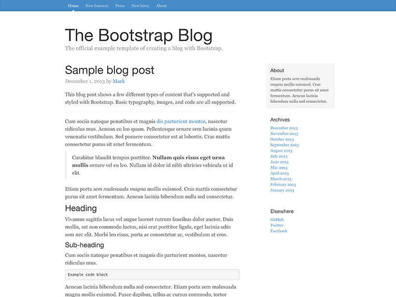
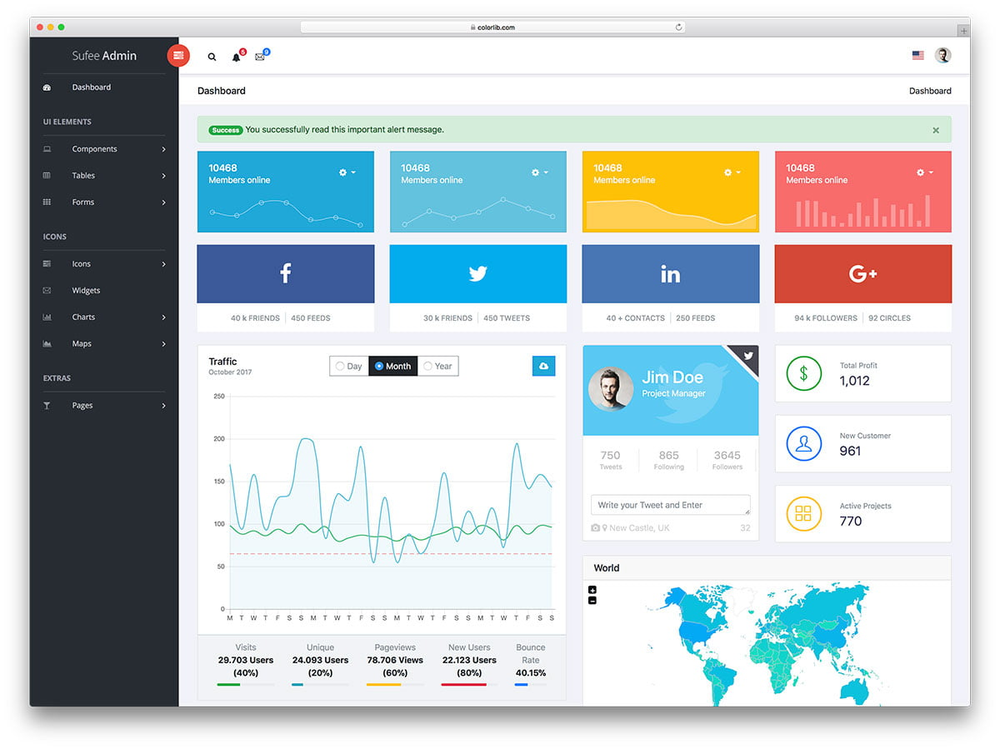

# Building Components With Accessiblity In Mind

Prerequisites:
* Git
* Node/NPM
* VS Code
* GitHub account
* Headphones (please)

Miro board:

https://bit.ly/3CS1zdb

 

Wifi: // TODO

---
layout: image-right
image: /img/edge-compute/austin-gil-bio.png
---

<h1 class="text-4xl mt-10">Hey Im Austin Gil 👋</h1>

@heyAustinGIl

<h4 class="mb-4">Dev Advocate <a href="https://akamai.com">akamai.com</a></h4>
<h4 class="mb-4">OSS Maintainer of <a href="https://vuetensils.austingil.com">Vuetensils</a></h4>
<h4 class="mb-4">Chiweenie enthusiast</h4>
<h4 class="mb-4">Perfect marshmallow roaster</h4>

Come talk to me about edge compute, web development, JavaScript, Vue.js, a11y, Chiweenies, or whatever :D

---

# WebAIM Million

A report on the accessibility of the top 1,000,000 home pages (webaim.org/projects/million)

<v-clicks>

51,379,694 distinct accessibility errors (🤖)

Average of 51.4 errors per page

Most common issues discovered:

1. Low contrast text: 86.4%
2. Missing alternative text for images: 60.6%
3. Missing form input labels: 54.4%
4. Empty links: 51.3%
5. Missing document language: 28.9%
6. Empty buttons: 26.9%

</v-clicks>

---

# Screen Readers & Keyboards

Markup determines how assistive technology interact with your page:

<v-clicks>

- Order of elements
- Landmarks
- Semantic tags
- Roles
- ARIA attributes

Accessibility Tree: DevTools > Elements > Accessibility

</v-clicks>

---

# Semantics Matter

<v-clicks>

</v-clicks>

---
layout: statement
---

# Pop Quiz!

<v-clicks>

If a background color is &nbsp;#bada55&nbsp;

And WCAG AA requires color contrast ratio of 4.5:1

What color should the foreground text be...?

🤷 (pfft)

</v-clicks>
