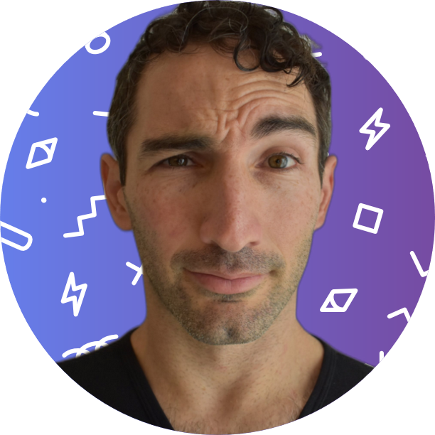
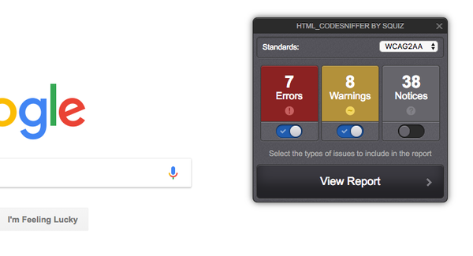

<!--  -->

# Hi, I'm Austin Gil 👋

<v-clicks>

Senior Developer Advocate @ Akamai ([akamai.com](https://akamai.com))

Focus on edge compute (ask me)

# That's Nugget -->

Goodest boy @ my house

Focus on foodiez, nappiez, squirrels

</v-clicks>

---
layout: statement
---

# Thinking About A11y
## So No One Else Has To

<!-- <div class="abs-br m-6 flex gap-2">
  <button @click="$slidev.nav.openInEditor()" title="Open in Editor" class="text-xl icon-btn opacity-50 !border-none !hover:text-white">
    <carbon:edit />
  </button>
  <a href="https://github.com/slidevjs/slidev" target="_blank" alt="GitHub"
    class="text-xl icon-btn opacity-50 !border-none !hover:text-white">
    <carbon-logo-github />
  </a>
</div> -->

<!--
The last comment block of each slide will be treated as slide notes. It will be visible and editable in Presenter Mode along with the slide. [Read more in the docs](https://sli.dev/guide/syntax.html#notes)
-->

---
layout: statement
---

# Introduction


---
layout: image
image: img/a11y/a11y.png
---

---

# What is a11y

"<b>Accessibility is the practice of making your websites usable by as many people as possible.</b>" - MDN

<v-click>

Impairments can be:
- Visual
- Hearing
- Mobility
- Cognitive
- Technological
- Temporary

</v-click>
<v-click>

WCAG: Web Content Accessibility Guidelines

</v-click>

---

# Why you should care

Accessibility has a lot of positive benefits

<v-clicks>

- More users = more conversions
- Better markup = happy robots (SEO)
- Legal compliance = fewer lawsuits
- Ethical = Austin feels better

</v-clicks>

---

# The HARD truth

<v-clicks>

It's hard to learn (well)

It's hard to remember

It's hard to implement

It's hard to test

</v-clicks>

---

# Some hard facts

<v-clicks>

The WebAIM Million Report - a11y of top 1 million websites

Feb 2021 - 51,379,694 distinct errors / 51.4 errors per page

</v-clicks>

<v-click>

Most common issues:

* Low contrast text: 86.4%
* Missing alternative text for images: 60.6%
* Missing form input labels: 54.4%
* Empty links: 51.3%
* Missing document language: 28.9%
* Empty buttons: 26.9%

More details at [webaim.org/projects/million](https://webaim.org/projects/million/)

(**These numbers are based on automated WCAG metrics**)

</v-click>

---
layout: image
image: img/a11y/nugget-tired.jpg
---

---
layout: statement
---

# Challenge
## How do we get folks involved?

---

# Some approaches

<v-clicks>

- Educating & advocating
- Pleading & guilt tripping
- Warning & threatening

</v-clicks>

---
layout: statement
---

# Another Solution
## Meet people where they are!

---
layout: image-left
image: img/a11y/nugget-snow.jpg
---

# Designers

Design software

---

# Anecdote

If a background color is <span style="color:#000;background:#BADA55;">&nbsp;#bada55&nbsp;</span>

<v-clicks>

And WCAG AA requires color contrast ratio of 4.5:1

What color should the foreground text be...?

🤷 (pfft)

</v-clicks>

---

# Plugins


Stark ([getstark.co](https://www.getstark.co/))
- [Figma](https://www.figma.com/)
- [Sketch](https://www.sketch.com/)
- [AdobeXD](https://www.adobe.com/products/xd.html)


---

# Make It Easy

<div class="grid grid-cols-3 gap-4">

<div>
Accessible Palette


Build multi-shade palette

[accessiblepalette.com](https://accessiblepalette.com/)
</div>

<div>
Accessible Brand Colors


Combine & audit existing colors

[abc.useallfive.com](https://abc.useallfive.com/)
</div>

<div>
Accessible Color Generator


Find accessible alternatives

[learnui.design/tools/accessible-color-generator.html](https://learnui.design/tools/accessible-color-generator.html)
</div>

</div>

---
layout: image-right
image: img/a11y/nugget-crazy.jpg
---

# Developers

IDEs, CLIs, Browsers
---

# IDE Extensions


<v-click>

VS Code:
- [aXe Accessibility Linter](https://marketplace.visualstudio.com/items?itemName=deque-systems.vscode-axe-linter) by Deque
- [webhint](https://marketplace.visualstudio.com/items?itemName=webhint.vscode-webhint)

</v-click>

<v-clicks>

Pros: Very easy to get started

Cons: Hard to coordinate across teams (IDE, extension, settings)

</v-clicks>

---

# Linters

Static code analysis + red squigglies = 😍

<v-clicks>

- Prevent unused variables
- Enforce semicolons
- Prefer single or double-quotes

</v-clicks>

<v-clicks>

ESLint ([eslint.org](https://eslint.org/))

- Vue: [eslint-plugin-vuejs-accessibility](https://www.npmjs.com/package/eslint-plugin-vuejs-accessibility)
- React/JSX: [eslint-plugin-jsx-a11y](https://www.npmjs.com/package/eslint-plugin-jsx-a11y)
- Lit HTML: [eslint-plugin-lit-a11y](https://www.npmjs.com/package/eslint-plugin-lit-a11y)

Works great with pre-commit hooks.

</v-clicks>

---

# Frameworks & Libraries

Write it correctly once and propagate.

<v-click>


- Required props (input label)
- Optional/Default props (input ID)
- TypeScript (more red squigglies)

</v-click>

<v-click>

Component libraries:
- [Vuetensils](https://vuetensils.austingil.com/) (unstyled)
- [PrimeVue](https://www.primefaces.org/primevue/) (minimal styles)
- [Vuetify](https://vuetifyjs.com/) (Material Design)
- [BootstrapVue](https://bootstrap-vue.org/) (Bootstrap)
<!-- Vue: Vuetensils (I made this one) -->
<!-- React: Reach UI
Web components: Lion -->

</v-click>

---

# CSS

```css
img:not([alt]){
  outline: 5px dashed red;
  outline-offset: 5px;
}
```

<v-clicks>

- Use CSS to highlight accessibility issues 
- Detect dev mode or staging site
- Don’t include in your production website!

A11y.css ([ffoodd.github.io/a11y.css](https://ffoodd.github.io/a11y.css/))

</v-clicks>

---
layout: image-left
image: img/a11y/nugget-blanket.jpg
---

# Code Review,<br>Tests,<br>& QA

Pull requests, staging site, CI/CD 

---

# Pull Requests

Accesslint ([accesslint.com](https://accesslint.com/))


<v-click>

- Checks a11y during code reviews
- Immediate feedback
- Faster reviews

</v-click>

---

# Browser Extensions


aXe DevTools by Deque ([deque.com/axe/devtools](https://www.deque.com/axe/devtools/))
- Works in the browser dev tools


---

# Browser Bookmarklets



Very similar to browser extensions. Can highlight and scroll to errors.

- HTML_CodeSniffer ([squizlabs.github.io/HTML_CodeSniffer](https://squizlabs.github.io/HTML_CodeSniffer/))
- Tota11y ([khan.github.io/tota11y](https://khan.github.io/tota11y/))
- Sa11y ([ryersondmp.github.io/sa11y](https://ryersondmp.github.io/sa11y/))

---

# CI/CD & Deployment

Test code at the source. Not the edges.

<v-click>

Cypress ([cypress.io](https://www.cypress.io/)) is amazing

</v-click>

<v-clicks>

- Run tests in real browsers (not synthetic)
- [cypress-axe](https://www.npmjs.com/package/cypress-axe) by Deque
- Test entire pages or just components
- Integrate into CI/CD
- Prevent pushing a11y issues to prod

</v-clicks>

---
layout: statement
---

# Caveats
## Robots are not humans

---

<v-clicks>

100% WCAG score doesn't always mean accessible. <br>
(see “[Building the most inaccessible site possible with a perfect Lighthouse score](https://www.matuzo.at/blog/building-the-most-inaccessible-site-possible-with-a-perfect-lighthouse-score/)” by [Manuel Matuzovic](https://twitter.com/mmatuzo))

Accessibility is about the numbers, it's about the experience.

Tooling and automation doesn't replace real user testing.

Analytics can tell you details about YOUR users.

</v-clicks>

---
layout: statement
---

# Final thoughts

---

<v-clicks>

Not everyone needs to be an expert (🌶).

A robot-minion army multiplies your impact (🤖 = 👨‍💻x100).

Make it easy to do right and hard to do wrong.

Robots do not replace experts. They empower by unlocking time and brain power.

</v-clicks>

---

# 🍴 Vuetensils 🛠️

A 'naked' component library that provides the markup and functionality you need to create accessible, lightweight, on-brand applications.

- Nearly no styles
- Accessible
- Zero dependencies (besides Vue Demi)
- Vue 2 + 3 and Vite
- 19 components, 4 directives, 5 filters, 2 composables

---
layout: image-right
image: img/a11y/nugget-hiking.jpg
---

# Thanks 😘

Here's some links

- Making Accessibility More Accessible ([austingil.com/making-accessibility-more-accessible](https://austingil.com/making-accessibility-more-accessible/))
- Vuetensils ([vuetensils.austingil.com](https://vuetensils.austingil.com/))
- Newsletter ([austingil.com/newsletter](https://austingil.com/newsletter))
- Twitter ([@heyAustinGil](https://twitter.com/@heyAustinGil))
- Twitch ([@heyAustinGil](https://twitch.tv/heyAustinGil))
- Nugget is on Instagram ([@NuggetTheMighty](https://www.instagram.com/nuggetthemighty/))