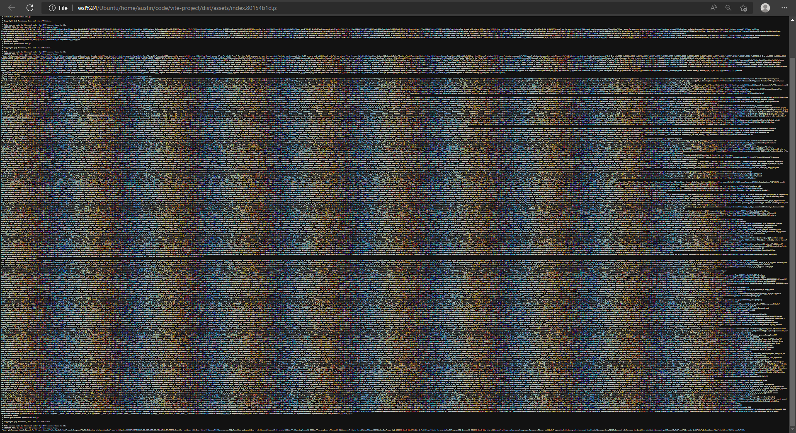
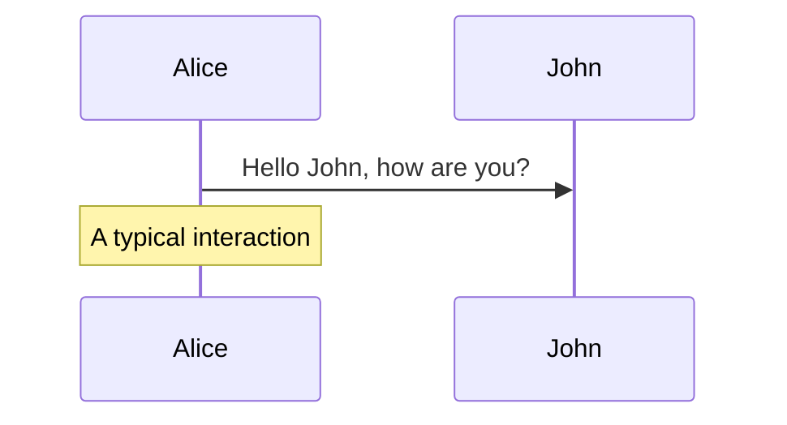
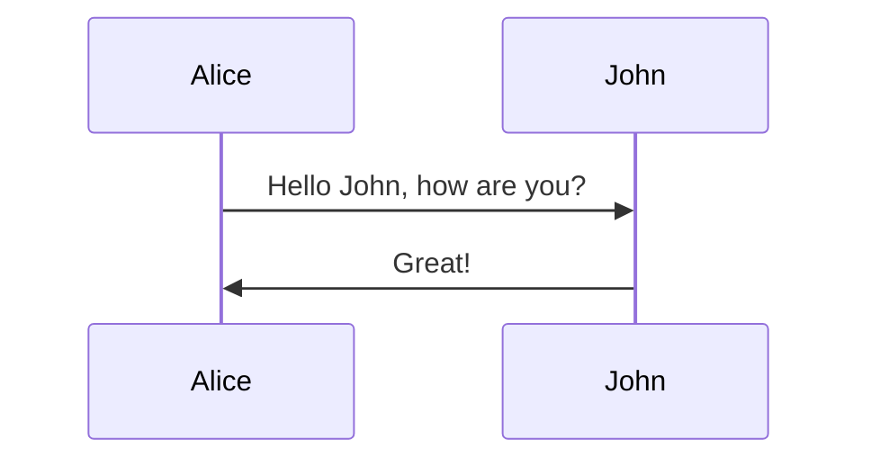

---
layout: statement
---

# Story time

<!-- - Junior developer code changes not showing in the browser.
- I noticed the issue was not the code, but how the tooling worked.
- "How does that div get to the browser"
- "The browser opens up the vue app, the router finds match, and loads the .vue component."

Which is kind right, but missing some steps. -->

---
layout: statement
---

# Let's take a trip back in time

---
preload: false
---

<audio autoplay>
  <source src="/img/make-div/dial-up.mp3" type="audio/mpeg">
</audio>

<!-- Let's travel back in time to a better day

When you'd play outside, scrape your knee, and your dad would literally rub dirt in it.

You get home and run upstairs.

Sit down at the computer and use your big toe to hit the power button on your GATEWAY 2000 PENTIUM II

As the 64 MB of RAM kick in and the fans start whining, you yell down the stairs

"Get off the phone! I need to use the internet."

Then you get that sweet, sweet sound  -->

<!-- Give me that sound, concentrated, straight to the vein -->

---
layout: statement
---

# Version control?

---
layout: statement
---

# CI/CD?

---
layout: statement
---

# Deploy previews?

---

# We only had two tools:

<div class="grid gap-4 grid-cols-2">
<v-clicks>


</v-clicks>
</div>

---
layout: statement
---

# Those were good times...

---
layout: statement
---

# Simpler times...

---
layout: statement
---

# Things have changed...

---
layout: statement
---

# The internet has changed...

---
layout: statement
---

# Websites have become more complex...

---
layout: statement
---

# And so tooling had to evolve...

<!-- CD was the thing the internet came on

Deploy previews? We didn't even have staging sites. Just edited in production. Cowboy coding. THe most alive I've ever felt -->

---
layout: image
image: /img/make-div/logos.svg
---

<!-- # WTF have we done!?!? -->

---
layout: statement
---

# What's a dev gotta do to make a \<div\> around here!?

A journey following your code from the editor
through build processes <br> 
into deployment pipelines
out to the public internet <br>
and finally rendered in a user's browser

---

# Start with a little bit of magic

What's the first thing you do before you start writing code?

<v-clicks>

Open terminal & recite the magical incantation: `npm run dev` (or some other spell)

That starts a local dev server for working on the project.
</v-clicks>

---

# Why do I need a dev server?

<v-clicks>

- File (`file:///C:/path/to/index.html`) is not HTTP (`http://localhost:42069`)
- Support GET, POST, PUT, PATCH, DELETE, etc. 
- Absolute (`/path`) vs. relative (`../path`)
- Server-side rendering
- No latency === faster
- Can work offline
- Run background processes...
</v-clicks>

---

# File Watchers

<v-clicks>

Websites don't know when a files have changed.

In the past: `ctrl+r` || `F5` (carpal tunnel 😱)

These days: `ctrl+s` => instant browser updates 

This is called "**Hot Module Replacement**" or HMR.
</v-clicks>

---

# HMR

<v-clicks>

- Dev server starts file watcher to listen for changes in file system (e.g. `chokidar`)
- On file change, dev server may respond: **compiling, transpiling, bundling**
- Dev server sends changes to client (e.g. `WebSockets`)
- Client updates the web app
</v-clicks>
<v-click>

You can even see this in the network tab if you're into that sort of thing...

</v-click>

---
layout: statement
---

# Compiling, Transpiling, Bundling...what?

---

# More Magic When You Hit Save <span class="font-mono">✍(▀̿Ĺ̯▀̿ ̿)</span>

```jsx
// main.js
import React from 'react'
import ReactDOM from 'react-dom/client'
import App from './App.jsx'

ReactDOM.createRoot(document.getElementById('root')).render(
  <App />
)
```

<v-clicks>

Modern apps have several files called **modules**.

These modules get stitched together by a **bundler** (e.g. `rollup`).

(Some bundlers can also handle non-JS assets, but that's for another today)

</v-clicks>

---

# Bundlers are cool!

<v-clicks>

You provide the bundler with an entry point (e.g `main.js`)

Bundler generates a relationship map of all the files.

"**Dependency Resolution**"

Important to avoid duplicate code or circular dependencies.

With the dependency graph it can produce production assets.

</v-clicks>

---
layout: image
image: img/make-div/dependency-graph.jpg
---

---

# Just one problem...

<div class="grid grid-cols-2">
<v-clicks>
<div>

### What you see:
- .jsx
- .tsx
- .vue
- .svelte
- .astro
- .webc
</div>
<div>

### What the browser sees:
<div class="mt-10 text-5xl font-mono">¯\_(ツ)_/¯</div>
</div>
</v-clicks>
</div>

---
layout: image
image: /img/make-div/spongebob.jpg
---

<style>
.animate-letters span {
  opacity: 0;
  animation: fadein .3s ease-in forwards;
}
.animate-letters span:nth-child(2) {
  animation-delay: 0.1s;
}
.animate-letters span:nth-child(3) {
  animation-delay: 0.2s;
}
.animate-letters span:nth-child(4) {
  animation-delay: 0.3s;
}
.animate-letters span:nth-child(5) {
  animation-delay: .4s;
}
.animate-letters span:nth-child(6) {
  animation-delay: .5s;
}
.animate-letters span:nth-child(7) {
  animation-delay: .6s;
}
.animate-letters span:nth-child(8) {
  animation-delay: .7s;
}
.animate-letters span:nth-child(9) {
  animation-delay: .8s;
}
.animate-letters span:nth-child(10) {
  animation-delay: .9s;
}
.animate-letters span:nth-child(11) {
  animation-delay: 1s;
}
.animate-letters span:nth-child(12) {
  animation-delay: 1.1s;
}
.animate-letters span:nth-child(13) {
  animation-delay: 1.2s;
}
@keyframes fadein {
  0%   { opacity: 0; }
  100% { opacity: 1; }
}
</style>

<h1 class="text-center">
<span class="animate-letters text-8xl" style="-webkit-text-stroke: 1px black;">
<span>T</span>
<span>r</span>
<span>a</span>
<span>n</span>
<span>s</span>
<span>p</span>
<span>i</span>
<span>l</span>
<span>a</span>
<span>t</span>
<span>i</span>
<span>o</span>
<span>n</span>
</span>
</h1>

---

# Transpilers (e.g. `babel`)

<v-clicks>
<div>

### What:
Like a combination of a compiler and a translator.<br>
Takes source code and converts it into another equivalent language and/or syntax.
</div>
<div>

### Why: 
Turn language the browser does not understand (TS) into one that it does (JS).<br>
Turn syntax the browser does not understand (ESNext) into one that it does (ES2015).
</div>
<div>

### How (depends on transpiler):
1. Generate tokens for each part of the source code.<br>
2. Transform tokens into an Abstract Syntax Tree (AST).
</div>
</v-clicks>

---
layout: statement
---

# WTF is an AST!?!?

---

<style>
.slidev-code-wrapper.slidev-vclick-hidden {
  display: none;
}
</style>

<div class="grid grid-cols-2 gap-4">
<div>

JS program:
<div class="grid">

<div class="col-start-1	row-start-1	slidev-code-wrapper relative group"><pre class="slidev-code language-js"><code><span class="line slidev-vclick-target highlighted">console<span class="token punctuation">.</span><span class="token function">log</span><span class="token punctuation">(</span><span class="token string">'poop'</span><span class="token punctuation">)</span></span></code></pre><button class="slidev-code-copy absolute top-0 right-0 transition opacity-0 group-hover:opacity-20 hover:!opacity-100" title="Copy"><svg class="slidev-icon p-2 w-8 h-8" preserveAspectRatio="xMidYMid meet" viewBox="0 0 256 256" width="1.2em" height="1.2em"><path fill="currentColor" d="M200 32h-36.3a47.8 47.8 0 0 0-71.4 0H56a16 16 0 0 0-16 16v168a16 16 0 0 0 16 16h144a16 16 0 0 0 16-16V48a16 16 0 0 0-16-16Zm-72 0a32.1 32.1 0 0 1 32 32H96a32.1 32.1 0 0 1 32-32Zm72 184H56V48h26.8A47.2 47.2 0 0 0 80 64v8a8 8 0 0 0 8 8h80a8 8 0 0 0 8-8v-8a47.2 47.2 0 0 0-2.8-16H200Z"></path></svg></button></div>

<div v-click="6" class="col-start-1	row-start-1	slidev-code-wrapper relative group"><pre class="slidev-code language-js"><code class="opacity-30"><span class="line slidev-vclick-target highlighted">console<span class="token punctuation">.</span><span class="token function">log</span><span class="token punctuation">(</span><span class="token string">'poop'</span><span class="token punctuation">)</span></span></code></pre><button class="slidev-code-copy absolute top-0 right-0 transition opacity-0 group-hover:opacity-20 hover:!opacity-100" title="Copy"><svg class="slidev-icon p-2 w-8 h-8" preserveAspectRatio="xMidYMid meet" viewBox="0 0 256 256" width="1.2em" height="1.2em"><path fill="currentColor" d="M200 32h-36.3a47.8 47.8 0 0 0-71.4 0H56a16 16 0 0 0-16 16v168a16 16 0 0 0 16 16h144a16 16 0 0 0 16-16V48a16 16 0 0 0-16-16Zm-72 0a32.1 32.1 0 0 1 32 32H96a32.1 32.1 0 0 1 32-32Zm72 184H56V48h26.8A47.2 47.2 0 0 0 80 64v8a8 8 0 0 0 8 8h80a8 8 0 0 0 8-8v-8a47.2 47.2 0 0 0-2.8-16H200Z"></path></svg></button></div>

<div v-click="7" class="col-start-1	row-start-1	slidev-code-wrapper relative group"><pre class="slidev-code language-js"><code><span class="line slidev-vclick-target highlighted">console<span class="opacity-30 token punctuation">.</span><span class="token function">log</span><span class="token punctuation">(</span><span class="opacity-30 token string">'poop'</span><span class="token punctuation">)</span></span></code></pre><button class="slidev-code-copy absolute top-0 right-0 transition opacity-0 group-hover:opacity-20 hover:!opacity-100" title="Copy"><svg class="slidev-icon p-2 w-8 h-8" preserveAspectRatio="xMidYMid meet" viewBox="0 0 256 256" width="1.2em" height="1.2em"><path fill="currentColor" d="M200 32h-36.3a47.8 47.8 0 0 0-71.4 0H56a16 16 0 0 0-16 16v168a16 16 0 0 0 16 16h144a16 16 0 0 0 16-16V48a16 16 0 0 0-16-16Zm-72 0a32.1 32.1 0 0 1 32 32H96a32.1 32.1 0 0 1 32-32Zm72 184H56V48h26.8A47.2 47.2 0 0 0 80 64v8a8 8 0 0 0 8 8h80a8 8 0 0 0 8-8v-8a47.2 47.2 0 0 0-2.8-16H200Z"></path></svg></button></div>

<div v-click="8" class="col-start-1	row-start-1	slidev-code-wrapper relative group"><pre class="slidev-code language-js"><code><span class="line slidev-vclick-target highlighted">console<span class="opacity-30 token punctuation">.</span><span class="opacity-30 token function">log</span><span class="opacity-30 token punctuation">(</span><span class="opacity-30 token string">'poop'</span><span class="opacity-30 token punctuation">)</span></span></code></pre><button class="slidev-code-copy absolute top-0 right-0 transition opacity-0 group-hover:opacity-20 hover:!opacity-100" title="Copy"><svg class="slidev-icon p-2 w-8 h-8" preserveAspectRatio="xMidYMid meet" viewBox="0 0 256 256" width="1.2em" height="1.2em"><path fill="currentColor" d="M200 32h-36.3a47.8 47.8 0 0 0-71.4 0H56a16 16 0 0 0-16 16v168a16 16 0 0 0 16 16h144a16 16 0 0 0 16-16V48a16 16 0 0 0-16-16Zm-72 0a32.1 32.1 0 0 1 32 32H96a32.1 32.1 0 0 1 32-32Zm72 184H56V48h26.8A47.2 47.2 0 0 0 80 64v8a8 8 0 0 0 8 8h80a8 8 0 0 0 8-8v-8a47.2 47.2 0 0 0-2.8-16H200Z"></path></svg></button></div>

<div v-click="9" class="col-start-1	row-start-1	slidev-code-wrapper relative group"><pre class="slidev-code language-js"><code><span class="line slidev-vclick-target highlighted"><span class="opacity-30">console</span><span class="opacity-30 token punctuation">.</span><span class="token function">log</span><span class="opacity-30 token punctuation">(</span><span class="opacity-30 token string">'poop'</span><span class="opacity-30 token punctuation">)</span></span></code></pre><button class="slidev-code-copy absolute top-0 right-0 transition opacity-0 group-hover:opacity-20 hover:!opacity-100" title="Copy"><svg class="slidev-icon p-2 w-8 h-8" preserveAspectRatio="xMidYMid meet" viewBox="0 0 256 256" width="1.2em" height="1.2em"><path fill="currentColor" d="M200 32h-36.3a47.8 47.8 0 0 0-71.4 0H56a16 16 0 0 0-16 16v168a16 16 0 0 0 16 16h144a16 16 0 0 0 16-16V48a16 16 0 0 0-16-16Zm-72 0a32.1 32.1 0 0 1 32 32H96a32.1 32.1 0 0 1 32-32Zm72 184H56V48h26.8A47.2 47.2 0 0 0 80 64v8a8 8 0 0 0 8 8h80a8 8 0 0 0 8-8v-8a47.2 47.2 0 0 0-2.8-16H200Z"></path></svg></button></div>

<div v-click="10" class="col-start-1	row-start-1	slidev-code-wrapper relative group"><pre class="slidev-code language-js"><code><span class="line slidev-vclick-target highlighted"><span class="opacity-30">console</span><span class="opacity-30 token punctuation">.</span><span class="opacity-30 token function">log</span><span class="opacity-30 token punctuation">(</span><span class="token string">'poop'</span><span class="opacity-30 token punctuation">)</span></span></code></pre><button class="slidev-code-copy absolute top-0 right-0 transition opacity-0 group-hover:opacity-20 hover:!opacity-100" title="Copy"><svg class="slidev-icon p-2 w-8 h-8" preserveAspectRatio="xMidYMid meet" viewBox="0 0 256 256" width="1.2em" height="1.2em"><path fill="currentColor" d="M200 32h-36.3a47.8 47.8 0 0 0-71.4 0H56a16 16 0 0 0-16 16v168a16 16 0 0 0 16 16h144a16 16 0 0 0 16-16V48a16 16 0 0 0-16-16Zm-72 0a32.1 32.1 0 0 1 32 32H96a32.1 32.1 0 0 1 32-32Zm72 184H56V48h26.8A47.2 47.2 0 0 0 80 64v8a8 8 0 0 0 8 8h80a8 8 0 0 0 8-8v-8a47.2 47.2 0 0 0-2.8-16H200Z"></path></svg></button></div>

</div>
</div>
<div>

AST representation (by [shift-js](https://github.com/shift-js/shift-js)):
<div style="font-size: 10px;">

```json {all|2|6-8,16,23|11-14|15|17-22}
{
  "type": "Module",
  "directives": [],
  "items": [
    {
      "type": "ExpressionStatement",
      "expression": {
        "type": "CallExpression",
        "callee": {
          "type": "StaticMemberExpression",
          "object": {
            "type": "IdentifierExpression",
            "name": "console"
          },
          "property": "log"
        },
        "arguments": [
          {
            "type": "LiteralStringExpression",
            "value": "poop"
          }
        ]
      }
    }
  ]
}
```
</div>
</div>
</div>

<div>More languages/transpilers at <a href="https://astexplorer.net/">astexplorer.net</a></div>

---

# Great! But what can I do with an AST?

<v-clicks>

1. Create a parser program called a "**Visitor**".
2. Transpiler can "walk" the Visitor any part of the AST and do **[insert action]**. 
3. Makes it possible to add, remove, transform, anything you want.
</v-clicks>
<v-click>

Good example of this: `.tsx` => `.js`
</v-click>

---

# Putting it all together

<div class="grid gap-4 grid-cols-2">
<div>

Source code: 

```jsx
// main.jsx
import React from 'react'
import ReactDOM from 'react-dom/client'
import App from './App.jsx'

ReactDOM.createRoot(
  document.getElementById('root')
).render(<App />)
```

- 4 separate files/libraries
- Written in JSX
- Uses modern syntax
</div>
<v-click>
<div>

Compiled, bundled, & transpiled code:



- One 139.76kb file
- Written in JavaScript
- Supports older syntax

</div>
</v-click>
</div>

---

# Keep in mind

<v-clicks>

- Code in your editor is not the same code in the browser.
- Dev server may behave differently than production server.
- Example was for client-side JS. Different story for SSR or SSG.
</v-clicks>

---
layout: statement
---

# Deploying

## <span class="font-mono">(╯°□°）╯︵ ┻━┻  ====> ┳━┳ ノ(゜-゜ノ)</span>

---

# Workflow

<v-clicks>

1. Make some changes
2. Git commit 
3. Git push
4. ??? (∩\*ᗜ\*)⊃━☆ﾟ.* (magic) 
5. Make sure nothing broke
</v-clicks>

<!--  In the old days, we'd just drag that sucker over the FileZilla GUI and drop it on the server. Of course, that's assuming we weren't just live editing the file on the server. Not anymore. Today, thing look a bit different. -->

---

# Continuous Integration & Delivery (CI/CD)

<v-clicks>

Most Git hosting services provide some sort of mechanism that can respond to new commits (e.g GitHub Actions).

With GitHub Actions:
</v-clicks>
<v-clicks>

- Create a folder called `.github/workflows/`.
- Add a `.yml` file (e.g. `ci.yml`).
- Push new commit to GitHub.
- GitHub run our Action.
</v-clicks>

---

# Example Action File

<div class="grid gap-4 grid-cols-2">

```yml {all|all|4|6|8|10|12}
# ci.yml
jobs:
  deploy:
    runs-on: ubuntu-latest
    steps:
      - uses: actions/checkout@v2

      - run: npm ci

      - run: npm run build

      - run: npm run deploy

```
<div>
<div v-click="1" class="mt-6">A machine that lives on GitHub's servers</div>
<div v-click="2" class="mt-15">running Ubuntu OS (with NPM installed)</div>
<div v-click="3" class="mt-9">checks out your repo's code,</div>
<div v-click="4" class="mt-9">installs NPM dependencies,</div>
<div v-click="5" class="mt-9">then runs the "build" command from your package.json file,</div>
<div v-click="6" class="mt-5">then runs the "deploy" command from your package.json file.</div>
</div>
</div>

---
layout: statement
---

# What do those 'build' and 'deploy' commands do?

---
layout: statement
---

<div class="text-9xl">It depends™<br>💩</div>

---

# Could be...

<v-clicks>

- Build production artifacts & upload to server.
- Create docker image & send to a registry.
- Run code quality checks (e.g. `TypeScript`, `ESLint`, `Vitest`).
- Static site generator & deploy to CDN (e.g. [Akamai CDN](https://www.akamai.com/solutions/content-delivery-network)).
</v-clicks>

---

# Keep in mind

<v-clicks>

- Dev environment (your computer) !== CI/CD environment (GitHub's computers).
- Dev assets !== production assets.
</v-clicks>

---
layout: statement
---

# It's the final section
(dee duh dee doo)

(dee duh dee doo doo)

---

# We need to answer one last question

<div class="grid grid-cols-2">
  <v-clicks>
    <div class="aspect-square	">
      <div>How do we get user from this...</div>
      
    </div>
    <div class="aspect-square	">
      <div>to this?</div>
      
    </div>
  </v-clicks>
</div>

---
layout: statement
---

# Step 1 - Networking 

# <span class="font-mono">(👉ﾟヮﾟ)👉   👈(ﾟヮﾟ👈)</span>

---

# When you type [austingil.com](https://austingil.com) into your browser...

Browser must first do a DNS lookup to get the IP address
<v-clicks>

1. Check browser cache.
2. Check local hosts file on computer.
3. Ping DNS server in the network stack (maybe local router cache or ISP cache).
</v-clicks>

---

# Uncached DNS lookup

<v-clicks>

1. Send request to DNS Recursive Resolver.
2. Resolver queries an Authoritative Root nameserver.
3. The root server responds with the address of an Authoritative Top Level Domain (TLD) nameserver (`.com`, `.net`, `.pizza`).
4. Resolver makes a request to the `.com` TLD.
5. The TLD server responds with IP address of the domain's nameserver.
6. Resolver sends a query to the domain's nameserver.
7. The IP address for austingil.com is returned to the Resolver.
8. Resolver responds to the web browser with the IP address of the domain.
</v-clicks>

---
layout: image
image: /img/make-div/dns.jpg
---

<style>
.slidev-page-44 { background-size: contain !important; }
</style>

---

# Keep in mind

Caching is a thing (and can be a pain in the butt):

<v-click>

- Browser
- Operating system
- Router
- ISP
<!-- - Edge compute
- Server -->
</v-click>

---
layout: statement
---

# Step 2 - Connecting 
# <span class="font-mono">💗(¯ з¯) (¯ε ¯)💗</span>

---

# Four parts

<v-clicks>

- Prepare the packet
- Open the connection
- Secure the connection
- Make the request
</v-clicks>

---

# Prepare a packet

With the server's IP address the browser can prepare a data packet to transmit.

Packet: a small segment of a larger message, sent over a network, then then recombined by the receiver.

<!-- - Ethernet -> modem -> ISP
- WiFi -> router -> modem -> ISP
- Cellular data network -->

---

# Open the connection

Your computer and the server connect using communication protocols TCP/IP.

Client requests a TCP over IP socket stream ("TCP handshake")
<v-clicks>

  - Client sends an SYN "initial request" packet to the target server
  - Server then responds with an SYN-ACK packet to agree to the process
  - Client sends an ACK packet to the target to confirm the process
  - Messages can now be sent.
</v-clicks>

---

# Secure connection

To encrypt messages, the browser and server set up TLS (or "SSL") handshake:
<v-clicks>

- Specify TLS version
- Decide on cipher suites
- Verify server's identity with it's TLS certificate
- Handhske is complete & session key is generated for encrypting data
</v-clicks>

---

# Make the request





<v-clicks>

<div>

Your browser sends a request using HTTP protocol.

<span class="text-8xl">💻</span>

```sh
GET / HTTP/1.1
Host: austingil.com
Connection: close
[...other headers]
```

</div>
<div>

(\*\***I can modify the request before reaching the server using Akamai EdgeWorkers**\*\*)

My Linode server beeps and boops to prepare HTML for the HTTP response

```sh
200 OK
[response headers]
```

(\*\***I can modify the response before reaching the client using Akamai EdgeWorkers**\*\*)
</div>
</v-clicks>

---

# Got multiple resources?

Once the browser verifies it has received all of packets of data, it can parse the HTML.

It will repeat the above process is every resource referenced by the HTML page.

If a resource is from a different domain than austingil.com, browser starts over from the DNS lookup.

For example, if you store staic assets (image, CSS, favicon, fonts, js, etc) on Akamai's CDN.

---
layout: statement
---

# Step 3 - Rendering 
# <span class="font-mono"> 🏗🧱🎨📖</span>

---

# Critical rendering path

The browser must complete several steps to render a web page

<v-clicks>

- Construct the DOM Tree (Object representation of HTML)
- Construct the CSSOM Tree (Object representation of DOM styles)
- Run JavaScript
- Create Render Tree (DOM + CSSOM for RENDERED nodes)
- Calculate Styles
- Generate Layout
- Create layers in case of animations
- Paint content as px to respective layer
- Composite (flatten layers onto the screen)

</v-clicks>

How you write CSS and JS impacts Style, Layout, Paint

<v-click>

Explore Critical render path in Chrome's performance panel 

</v-click>


---

# Caveats

SSR vs Client vs SSG

---

So when your boss asks why the website is broken...

Made a change -> commited to GitHub -> built by Actions -> uploaded to server -> URL -> Browser -> OS -> Wifi -> Router -> Modem -> ISP -> DNS resolution -> server's IP -> TCP handshake -> TLS handshake -> HTTP request -> EdgeWorker -> Linode -> EdgeWorker -> HTTP response -> download HTML -> download CSS -> download JS -> Render `<div>`

...or just say, "Works on my machine. Have you tried clearing your cache?"

---

# Resources: 

[Transpilers: How They Work and How To Build Your Own JS Transpiler](https://daily.dev/blog/transpilers-how-they-work) by [Chidume Nnamdi](https://twitter.com/ngArchangel)

[What happens when](https://github.com/alex/what-happens-when) by [Alex Gaynor](https://alexgaynor.net/)

---
layout: image-right
image: /img/edge-compute/austin-gil-bio.png
---

<h1 class="text-4xl mt-10 !mb-0">Hey Im Austin Gil 👋</h1>
<p class="mt-0">austingil.com | @heyAustinGIl</p>

<h4 class="mb-2">Dev Advocate <a href="https://akamai.com">akamai.com</a></h4>
<h4 class="mb-2">OSS Maintainer of <a href="https://vuetensils.austingil.com">Vuetensils</a></h4>
<h4 class="mb-2">Chiweenie enthusiast</h4>

I want to help you build better websites.

Over the last ten years, I've built projects for award-winning agencies, innovative tech start-ups, and government organizations.

Today, I create cool stuff for the web and share what I learn through writing, open-source, YouTube and Twitch, The Function Call, speaking and workshops.

Twitter

GitHub

YouTube

Twitch

LinkedIn

<div class="mt-10">Come talk to me about edge compute, JavaScript, Chiweenies, or whatever :D</div>


(ﾉ◕ヮ◕)ﾉ*:･ﾟ✧ 📦
(∩^o^)⊃━☆ *:･ﾟ✧ 📦

(。･_･)ノ”【】
ヽ(⌐■_■)ノ♪♬