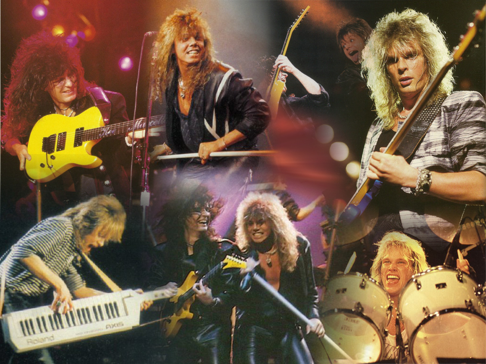
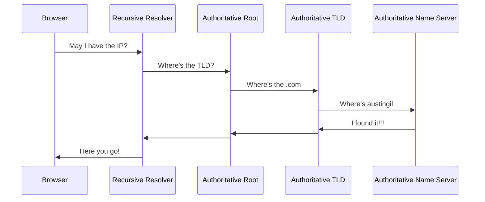
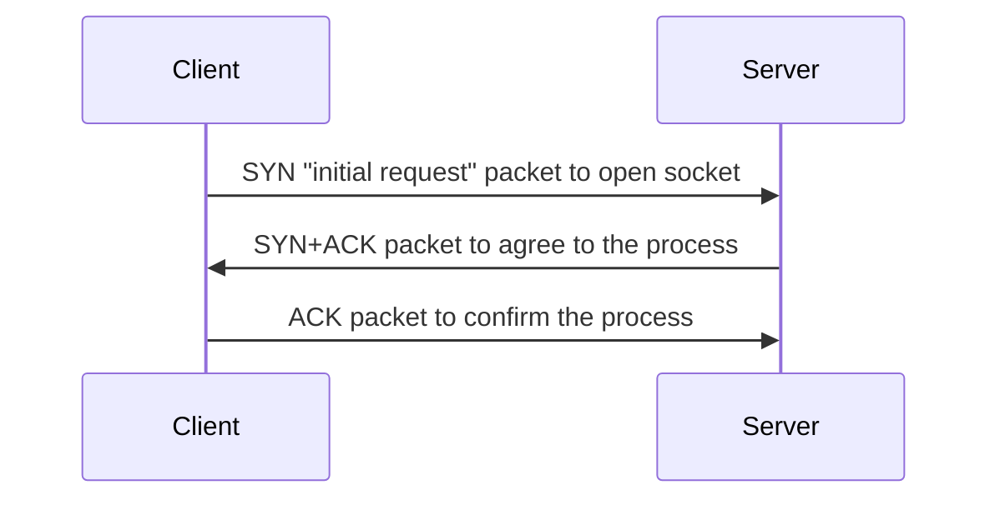
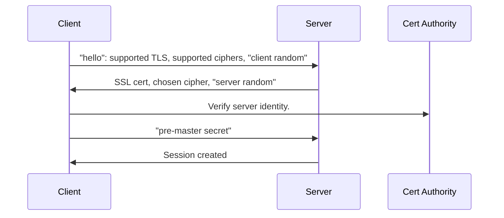

---
layout: statement
---

# Story time

<!-- - Junior developer code changes not showing in the browser.
- I noticed the issue was not the code, but how the tooling worked.
- "How does that div get to the browser"
- "The browser opens up the vue app, the router finds match, and loads the .vue component."

Which is kind right, but missing some steps. -->

---
layout: statement
---

# Let's take a trip back in time

---
preload: false
---

<audio autoplay>
  <source src="/img/make-div/dial-up-fast.mp3" type="audio/mpeg">
</audio>

<!-- Let's travel back in time to a better day

When you'd play outside, scrape your knee, and your dad would literally rub dirt in it.

You get home and run upstairs.

Sit down at the computer and use your big toe to hit the power button on your GATEWAY 2000 PENTIUM II

As the 64 MB of RAM kick in and the fans start whining, you yell down the stairs

"Get off the phone! I need to use the internet."

Then you get that sweet, sweet sound  -->

<!-- Give me that sound, concentrated, straight to the vein -->

---
layout: statement
---

# Version control?

---
layout: statement
---

# CI/CD?

---
layout: statement
---

# Deploy previews?

---

# We had two tools

<v-clicks>
<div class="grid gap-4 grid-cols-2">


</div>
</v-clicks>

---
layout: statement
---

# Those were good times...

---
layout: statement
---

# Simpler times...

---
layout: statement
---

# Things have changed...

---
layout: statement
---

# The internet has changed...

---
layout: statement
---

# Websites have become more complex...

---
layout: statement
---

# And so tooling had to evolve...

<!-- CD was the thing the internet came on

Deploy previews? We didn't even have staging sites. Just edited in production. Cowboy coding. THe most alive I've ever felt -->

---
layout: image
image: /img/make-div/logos.svg
---

<!-- # WTF have we done!?!? -->

---
layout: statement
---

# What's a dev gotta do to make a \<div\> around here!?

A journey following your code from the editor
through build processes <br> 
into deployment pipelines
out to the public internet <br>
and finally rendered in a user's browser

---

# Start with a bit of magic

What's the first thing you do before you start writing code?

<v-clicks>

Open terminal & recite the magical incantation (e.g. `npm run dev`)

That starts a local dev server for working on the project.
</v-clicks>

---

# Why do I need a dev server?

<v-clicks>

- File (`file:///C:/index.html`) != HTTP (`http://localhost:42069`)
- Support GET, POST, PUT, PATCH, DELETE, etc. 
- Absolute (`/path`) vs. relative (`../path`)
- Server-side rendering
- No latency === faster
- Can work offline
- Run background processes...
</v-clicks>

---

# File Watchers

<v-clicks>

Websites don't know when a files have changed.

In the past: `ctrl+r` || `F5` (carpal tunnel 😱)

These days: `ctrl+s` => instant browser updates 

This is called "**Hot Module Replacement**" or HMR.
</v-clicks>

---

# HMR

<v-clicks>

- Dev server starts file watcher to listen for changes (e.g. `chokidar`)
- On file change, dev server may respond: **compiling, transpiling, bundling**
- Dev server sends changes to client (e.g. `WebSockets`)
- Client updates the web app
</v-clicks>
<v-click>

You can even see this in the network tab if you're into that sort of thing...

</v-click>

---
layout: statement
---

# Compiling, Transpiling, Bundling...what?

---

# More Magic When You Save

```jsx
// main.js
import React from 'react'
import ReactDOM from 'react-dom/client'
import App from './App.jsx'

ReactDOM.createRoot(document.getElementById('root')).render(
  <App />
)
```

<v-clicks>

Modern apps have several files called **modules**.

These modules get stitched together by a **bundler** (e.g. `rollup`).

</v-clicks>

---
layout: image-left
image: img/make-div/flo.png
---

# Bundlers are cool!

<v-clicks>

You provide entry point (e.g `main.js`)

Bundler maps out file relationship.

"**Dependency Resolution**"

Avoid duped code or circular deps.

Produces production assets.

A depenecy graph looks like this...

</v-clicks>

---
layout: image
image: img/make-div/dependency-graph.jpg
---

---

# Just one problem...

<div class="grid grid-cols-2">
<v-clicks>
<div>

### What you see:
- .jsx
- .tsx
- .vue
- .svelte
- .astro
- .webc
</div>
<div>

### What the browser sees:
<div class="mt-10 text-5xl font-mono">¯\_(ツ)_/¯</div>
</div>
</v-clicks>
</div>

---
layout: image
image: /img/make-div/spongebob.jpg
---

<style>
.animate-letters span {
  opacity: 0;
  animation: fadein .3s ease-in forwards;
}
.animate-letters span:nth-child(2) {
  animation-delay: 0.1s;
}
.animate-letters span:nth-child(3) {
  animation-delay: 0.2s;
}
.animate-letters span:nth-child(4) {
  animation-delay: 0.3s;
}
.animate-letters span:nth-child(5) {
  animation-delay: .4s;
}
.animate-letters span:nth-child(6) {
  animation-delay: .5s;
}
.animate-letters span:nth-child(7) {
  animation-delay: .6s;
}
.animate-letters span:nth-child(8) {
  animation-delay: .7s;
}
.animate-letters span:nth-child(9) {
  animation-delay: .8s;
}
.animate-letters span:nth-child(10) {
  animation-delay: .9s;
}
.animate-letters span:nth-child(11) {
  animation-delay: 1s;
}
.animate-letters span:nth-child(12) {
  animation-delay: 1.1s;
}
.animate-letters span:nth-child(13) {
  animation-delay: 1.2s;
}
@keyframes fadein {
  0%   { opacity: 0; }
  100% { opacity: 1; }
}
</style>

<h1 class="text-center">
<span class="animate-letters text-8xl" style="-webkit-text-stroke: 1px black;">
<span>T</span>
<span>r</span>
<span>a</span>
<span>n</span>
<span>s</span>
<span>p</span>
<span>i</span>
<span>l</span>
<span>a</span>
<span>t</span>
<span>i</span>
<span>o</span>
<span>n</span>
</span>
</h1>

---

# Transpilers (e.g. `babel`)

<v-clicks>
<div>

### What:
<div class="text-2xl mb-4">
Like a combination of a compiler and a translator.<br>
Converts source code into another equivalent language and/or syntax.
</div>
</div>
<div>

### Why: 
<div class="text-2xl mb-4">
Turn language browsers don't understand (<b>TS</b>) into one they do (<b>JS</b>).<br>
Turn syntax browsers don't understand (<b>ESNext</b>) into one they do (<b>ES2015</b>).
</div>
</div>
<div>

### How (depends on transpiler):
1. Generate tokens for each part of the source code.<br>
2. Transform tokens into an Abstract Syntax Tree (AST).
</div>
</v-clicks>

---
layout: statement
---

# WTF is an AST!?!?


---

<style>
.slidev-code-wrapper.slidev-vclick-hidden {
  display: none;
}
</style>

<div class="grid grid-cols-2 gap-4">
<div>

JS program:
<div class="grid">

<div class="col-start-1	row-start-1	slidev-code-wrapper relative group"><pre class="slidev-code language-js"><code><span class="line slidev-vclick-target highlighted">console<span class="token punctuation">.</span><span class="token function">log</span><span class="token punctuation">(</span><span class="token string">'poop'</span><span class="token punctuation">)</span></span></code></pre><button class="slidev-code-copy absolute top-0 right-0 transition opacity-0 group-hover:opacity-20 hover:!opacity-100" title="Copy"><svg class="slidev-icon p-2 w-8 h-8" preserveAspectRatio="xMidYMid meet" viewBox="0 0 256 256" width="1.2em" height="1.2em"><path fill="currentColor" d="M200 32h-36.3a47.8 47.8 0 0 0-71.4 0H56a16 16 0 0 0-16 16v168a16 16 0 0 0 16 16h144a16 16 0 0 0 16-16V48a16 16 0 0 0-16-16Zm-72 0a32.1 32.1 0 0 1 32 32H96a32.1 32.1 0 0 1 32-32Zm72 184H56V48h26.8A47.2 47.2 0 0 0 80 64v8a8 8 0 0 0 8 8h80a8 8 0 0 0 8-8v-8a47.2 47.2 0 0 0-2.8-16H200Z"></path></svg></button></div>

<div v-click="6" class="col-start-1	row-start-1	slidev-code-wrapper relative group"><pre class="slidev-code language-js"><code class="opacity-30"><span class="line slidev-vclick-target highlighted">console<span class="token punctuation">.</span><span class="token function">log</span><span class="token punctuation">(</span><span class="token string">'poop'</span><span class="token punctuation">)</span></span></code></pre><button class="slidev-code-copy absolute top-0 right-0 transition opacity-0 group-hover:opacity-20 hover:!opacity-100" title="Copy"><svg class="slidev-icon p-2 w-8 h-8" preserveAspectRatio="xMidYMid meet" viewBox="0 0 256 256" width="1.2em" height="1.2em"><path fill="currentColor" d="M200 32h-36.3a47.8 47.8 0 0 0-71.4 0H56a16 16 0 0 0-16 16v168a16 16 0 0 0 16 16h144a16 16 0 0 0 16-16V48a16 16 0 0 0-16-16Zm-72 0a32.1 32.1 0 0 1 32 32H96a32.1 32.1 0 0 1 32-32Zm72 184H56V48h26.8A47.2 47.2 0 0 0 80 64v8a8 8 0 0 0 8 8h80a8 8 0 0 0 8-8v-8a47.2 47.2 0 0 0-2.8-16H200Z"></path></svg></button></div>

<div v-click="7" class="col-start-1	row-start-1	slidev-code-wrapper relative group"><pre class="slidev-code language-js"><code><span class="line slidev-vclick-target highlighted">console<span class="opacity-30 token punctuation">.</span><span class="token function">log</span><span class="token punctuation">(</span><span class="opacity-30 token string">'poop'</span><span class="token punctuation">)</span></span></code></pre><button class="slidev-code-copy absolute top-0 right-0 transition opacity-0 group-hover:opacity-20 hover:!opacity-100" title="Copy"><svg class="slidev-icon p-2 w-8 h-8" preserveAspectRatio="xMidYMid meet" viewBox="0 0 256 256" width="1.2em" height="1.2em"><path fill="currentColor" d="M200 32h-36.3a47.8 47.8 0 0 0-71.4 0H56a16 16 0 0 0-16 16v168a16 16 0 0 0 16 16h144a16 16 0 0 0 16-16V48a16 16 0 0 0-16-16Zm-72 0a32.1 32.1 0 0 1 32 32H96a32.1 32.1 0 0 1 32-32Zm72 184H56V48h26.8A47.2 47.2 0 0 0 80 64v8a8 8 0 0 0 8 8h80a8 8 0 0 0 8-8v-8a47.2 47.2 0 0 0-2.8-16H200Z"></path></svg></button></div>

<div v-click="8" class="col-start-1	row-start-1	slidev-code-wrapper relative group"><pre class="slidev-code language-js"><code><span class="line slidev-vclick-target highlighted">console<span class="opacity-30 token punctuation">.</span><span class="opacity-30 token function">log</span><span class="opacity-30 token punctuation">(</span><span class="opacity-30 token string">'poop'</span><span class="opacity-30 token punctuation">)</span></span></code></pre><button class="slidev-code-copy absolute top-0 right-0 transition opacity-0 group-hover:opacity-20 hover:!opacity-100" title="Copy"><svg class="slidev-icon p-2 w-8 h-8" preserveAspectRatio="xMidYMid meet" viewBox="0 0 256 256" width="1.2em" height="1.2em"><path fill="currentColor" d="M200 32h-36.3a47.8 47.8 0 0 0-71.4 0H56a16 16 0 0 0-16 16v168a16 16 0 0 0 16 16h144a16 16 0 0 0 16-16V48a16 16 0 0 0-16-16Zm-72 0a32.1 32.1 0 0 1 32 32H96a32.1 32.1 0 0 1 32-32Zm72 184H56V48h26.8A47.2 47.2 0 0 0 80 64v8a8 8 0 0 0 8 8h80a8 8 0 0 0 8-8v-8a47.2 47.2 0 0 0-2.8-16H200Z"></path></svg></button></div>

<div v-click="9" class="col-start-1	row-start-1	slidev-code-wrapper relative group"><pre class="slidev-code language-js"><code><span class="line slidev-vclick-target highlighted"><span class="opacity-30">console</span><span class="opacity-30 token punctuation">.</span><span class="token function">log</span><span class="opacity-30 token punctuation">(</span><span class="opacity-30 token string">'poop'</span><span class="opacity-30 token punctuation">)</span></span></code></pre><button class="slidev-code-copy absolute top-0 right-0 transition opacity-0 group-hover:opacity-20 hover:!opacity-100" title="Copy"><svg class="slidev-icon p-2 w-8 h-8" preserveAspectRatio="xMidYMid meet" viewBox="0 0 256 256" width="1.2em" height="1.2em"><path fill="currentColor" d="M200 32h-36.3a47.8 47.8 0 0 0-71.4 0H56a16 16 0 0 0-16 16v168a16 16 0 0 0 16 16h144a16 16 0 0 0 16-16V48a16 16 0 0 0-16-16Zm-72 0a32.1 32.1 0 0 1 32 32H96a32.1 32.1 0 0 1 32-32Zm72 184H56V48h26.8A47.2 47.2 0 0 0 80 64v8a8 8 0 0 0 8 8h80a8 8 0 0 0 8-8v-8a47.2 47.2 0 0 0-2.8-16H200Z"></path></svg></button></div>

<div v-click="10" class="col-start-1	row-start-1	slidev-code-wrapper relative group"><pre class="slidev-code language-js"><code><span class="line slidev-vclick-target highlighted"><span class="opacity-30">console</span><span class="opacity-30 token punctuation">.</span><span class="opacity-30 token function">log</span><span class="opacity-30 token punctuation">(</span><span class="token string">'poop'</span><span class="opacity-30 token punctuation">)</span></span></code></pre><button class="slidev-code-copy absolute top-0 right-0 transition opacity-0 group-hover:opacity-20 hover:!opacity-100" title="Copy"><svg class="slidev-icon p-2 w-8 h-8" preserveAspectRatio="xMidYMid meet" viewBox="0 0 256 256" width="1.2em" height="1.2em"><path fill="currentColor" d="M200 32h-36.3a47.8 47.8 0 0 0-71.4 0H56a16 16 0 0 0-16 16v168a16 16 0 0 0 16 16h144a16 16 0 0 0 16-16V48a16 16 0 0 0-16-16Zm-72 0a32.1 32.1 0 0 1 32 32H96a32.1 32.1 0 0 1 32-32Zm72 184H56V48h26.8A47.2 47.2 0 0 0 80 64v8a8 8 0 0 0 8 8h80a8 8 0 0 0 8-8v-8a47.2 47.2 0 0 0-2.8-16H200Z"></path></svg></button></div>

</div>
</div>
<div>

AST representation (by [shift-js](https://github.com/shift-js/shift-js)):
<div style="font-size: 10px;">

```json {all|2|6-8,16,23|11-14|15|17-22}
{
  "type": "Module",
  "directives": [],
  "items": [
    {
      "type": "ExpressionStatement",
      "expression": {
        "type": "CallExpression",
        "callee": {
          "type": "StaticMemberExpression",
          "object": {
            "type": "IdentifierExpression",
            "name": "console"
          },
          "property": "log"
        },
        "arguments": [
          {
            "type": "LiteralStringExpression",
            "value": "poop"
          }
        ]
      }
    }
  ]
}
```
</div>
</div>
</div>

<div>More languages/transpilers at <a href="https://astexplorer.net/">astexplorer.net</a></div>

---

# Great! But what can I do with it?

<v-clicks>

1. Create a parser program called a "**Visitor**".
2. Transpiler can "walk" the Visitor any part of the AST and do **[insert action]**. 
3. Makes it possible to **add, remove, transform**, anything you want.
</v-clicks>
<v-click>

<h2 class="mt-10">Good example:</h2>

<div class="flex items-center gap-4 text-4xl">
<svg width="150" height="150" viewBox="0 0 32 32"><rect width="28" height="28" x="2" y="2" fill="#3178c6" rx="1.312"/><path fill="#fff" fill-rule="evenodd" d="M18.245 23.759v3.068a6.492 6.492 0 0 0 1.764.575a11.56 11.56 0 0 0 2.146.192a9.968 9.968 0 0 0 2.088-.211a5.11 5.11 0 0 0 1.735-.7a3.542 3.542 0 0 0 1.181-1.266a4.469 4.469 0 0 0 .186-3.394a3.409 3.409 0 0 0-.717-1.117a5.236 5.236 0 0 0-1.123-.877a12.027 12.027 0 0 0-1.477-.734q-.6-.249-1.08-.484a5.5 5.5 0 0 1-.813-.479a2.089 2.089 0 0 1-.516-.518a1.091 1.091 0 0 1-.181-.618a1.039 1.039 0 0 1 .162-.571a1.4 1.4 0 0 1 .459-.436a2.439 2.439 0 0 1 .726-.283a4.211 4.211 0 0 1 .956-.1a5.942 5.942 0 0 1 .808.058a6.292 6.292 0 0 1 .856.177a5.994 5.994 0 0 1 .836.3a4.657 4.657 0 0 1 .751.422V13.9a7.509 7.509 0 0 0-1.525-.4a12.426 12.426 0 0 0-1.9-.129a8.767 8.767 0 0 0-2.064.235a5.239 5.239 0 0 0-1.716.733a3.655 3.655 0 0 0-1.171 1.271a3.731 3.731 0 0 0-.431 1.845a3.588 3.588 0 0 0 .789 2.34a6 6 0 0 0 2.395 1.639q.63.26 1.175.509a6.458 6.458 0 0 1 .942.517a2.463 2.463 0 0 1 .626.585a1.2 1.2 0 0 1 .23.719a1.1 1.1 0 0 1-.144.552a1.269 1.269 0 0 1-.435.441a2.381 2.381 0 0 1-.726.292a4.377 4.377 0 0 1-1.018.105a5.773 5.773 0 0 1-1.969-.35a5.874 5.874 0 0 1-1.805-1.045Zm-5.154-7.638h4v-2.527H5.938v2.527H9.92v11.254h3.171Z"/></svg>

<p class="font-mono">===></p>

<svg width="150" height="150" viewBox="0 0 32 32"><path fill="#f5de19" d="M2 2h28v28H2z"/><path d="M20.809 23.875a2.866 2.866 0 0 0 2.6 1.6c1.09 0 1.787-.545 1.787-1.3c0-.9-.716-1.222-1.916-1.747l-.658-.282c-1.9-.809-3.16-1.822-3.16-3.964c0-1.973 1.5-3.476 3.853-3.476a3.889 3.889 0 0 1 3.742 2.107L25 18.128A1.789 1.789 0 0 0 23.311 17a1.145 1.145 0 0 0-1.259 1.128c0 .789.489 1.109 1.618 1.6l.658.282c2.236.959 3.5 1.936 3.5 4.133c0 2.369-1.861 3.667-4.36 3.667a5.055 5.055 0 0 1-4.795-2.691Zm-9.295.228c.413.733.789 1.353 1.693 1.353c.864 0 1.41-.338 1.41-1.653v-8.947h2.631v8.982c0 2.724-1.6 3.964-3.929 3.964a4.085 4.085 0 0 1-3.947-2.4Z"/></svg>
</div>

</v-click>

---

# Putting it all together

<div class="grid gap-4 grid-cols-2">
<div>

```jsx
// main.jsx
import React from 'react'
import ReactDOM from 'react-dom/client'
import App from './App.jsx'

ReactDOM.createRoot(
  document.getElementById('root')
).render(<App />)
```

- 4 separate files/libraries
- Written in JSX
- Uses modern syntax
</div>
<v-click>
<div>


- One 139.76kb file
- Written in JavaScript
- Supports older syntax

</div>
</v-click>
</div>

---

# Keep in mind

<v-clicks>

- Code in your editor is not the same code in the browser.
- Dev server may behave differently than production server.
- Example was for client-side JS. Different story for SSR or SSG.
</v-clicks>

---
layout: statement
---

# Deploying

## <span class="font-mono">(╯°□°）╯︵ ┻━┻  ===> ┳━┳ ノ(゜-゜ノ)</span>

---
class: text-5xl
---

# How my code gets to production

<v-clicks>

1. Make some changes
2. Git commit 
3. Git push
4. **(∩^ᗜ^)⊃━☆ﾟ.\* (???)** 
</v-clicks>

<!--  In the old days, we'd just drag that sucker over the FileZilla GUI and drop it on the server. Of course, that's assuming we weren't just live editing the file on the server. Not anymore. Today, thing look a bit different. -->

---

# Cont. Integration & Delivery (CI/CD)

<v-clicks>

Most Git services offer tools to respond to commits (e.g **GitHub Actions**).

With GitHub Actions:
</v-clicks>
<v-clicks>

- Create a folder called `.github/workflows/`.
- Add a `.yml` file (e.g. `ci.yml`).
- Push new commit to GitHub.
- GitHub runs our Action.
</v-clicks>

---

# Example Action File

Actions define a set of instructions for the Octocats to perform.

<div class="grid gap-4 grid-cols-2">
<div v-click="1">

```yml {all|all|4|6|8|10|12}
# ci.yml
jobs:
  deploy:
    runs-on: ubuntu-latest
    steps:
      - uses: actions/checkout@v2

      - run: npm ci

      - run: npm run build

      - run: npm run deploy

```
</div>
<div class="text-2xl">
<div v-click="1" class="mt-4">A machine on GitHub's servers</div>
<div v-click="2" class="mt-11">running Ubuntu OS</div>
<div v-click="3" class="mt-5">checks out your repo's code,</div>
<div v-click="4" class="mt-5">installs NPM dependencies,</div>
<div v-click="5" class="mt-5">then runs "build",</div>
<div v-click="6" class="mt-5">then runs "deploy".</div>
</div>
</div>

---
layout: statement
---

# What do `build` and `deploy` do?

---
layout: statement
---

<div class="text-9xl">It depends™<br>💩</div>

---

# Could be...

<v-clicks>

- Build production artifacts & upload to servers.
- Create docker image & send to a registry.
- Run code quality checks (e.g. `TypeScript`, `ESLint`, `Vitest`).
- Generate static site & distribute to CDN (e.g. [Akamai CDN](https://www.akamai.com/solutions/content-delivery-network)).
</v-clicks>

---

# Keep in mind

<v-clicks>

- Dev environment (your computer) != CI/CD environment (GH computers).
- Dev assets != production assets.
</v-clicks>

---
layout: image
image: img/make-div/europe.jpg
class: grid place-items-center text-center
---

<!--  -->
<div style="-webkit-text-stroke: 1px black;">

# It's the final question
### (dee duh dee doo)
### (dee duh dee dee doo)
</div>

---

# How do users get...

<div class="grid grid-cols-2">
  <v-clicks>
    <div class="aspect-square	">
      <div>from this...</div>
      
    </div>
    <div class="aspect-square	">
      <div>...to this?</div>
      
    </div>
  </v-clicks>
</div>

---
layout: statement
---

# Step 1 - Networking 

# <span class="font-mono">(👉ﾟヮﾟ)👉   👈(ﾟヮﾟ👈)</span>

---

# To load [austingil.com](https://austingil.com)

Browser need the IP address
<v-clicks>

1. Check browser cache.
2. Check local hosts file on computer.
3. Ping DNS server in the network stack (maybe router cache or ISP cache).
</v-clicks>

---

# No cache? DNS lookup time!

<v-clicks>

1. Send request to DNS Recursive Resolver.
2. Resolver queries an Authoritative Root nameserver.
3. Root server responds with the address of Top Level Domain (TLD) nameserver (`.com`, `.net`, `.pizza`).
4. Resolver makes a request to the `.com` TLD.
5. The TLD server responds with IP address of the domain's nameserver.
6. Resolver sends a query to the domain's nameserver.
7. The IP address for austingil.com is returned to the Resolver.
8. Resolver responds to the web browser with the IP address of the domain.
</v-clicks>

---


<!--

-->

---

# Keep in mind

Caching is a thing (and can be a pain in the butt):

<v-click>

- Browser
- Operating system
- Router
- ISP
<!-- - Edge compute
- Server -->
</v-click>

---
layout: statement
---

# Step 2 - Connecting 
# <span class="font-mono">💗(¯ з¯) (¯ε ¯)💗</span>

---

# Four parts

<v-clicks>

- 2.1 Prepare the packet
- 2.2 Open the connection
- 2.3 Secure the connection
- 2.4 Make the request
</v-clicks>

---

# 2.1 Prepare a packet

**Packet**: a small chunck of data from a larger message.

<v-click>

With the IP address the browser can prepare a packet for TCP/IP.
</v-click>


<!-- - Ethernet -> modem -> ISP
- WiFi -> router -> modem -> ISP
- Cellular data network -->

---

# 2.2 Open the connection

**TCP**: The Transmission Control Protocol ensures accurate data delivery.

**IP**: The Internet Protocol obtains the address where data is sent.

<v-clicks>

Your computer and the server connect using communication protocols TCP/IP.

</v-clicks>

---

# TCP "handshake"



---

# 2.3 Secure connection (htps)

To encrypt messages, the browser and server set up TLS (or "SSL") handshake:



<!-- <v-clicks>

- Specify TLS version
- Decide on cipher suites
- Verify server's identity with it's TLS certificate
- Handhske is complete & session key is generated for encrypting data
</v-clicks> -->

---
class: text-sm 
---

# 2.4 Make the request

<v-clicks>

<div class="grid grid-cols-2">

💻 request using Hypertext Transfer Protocol (HTTP).

```sh
GET / HTTP/1.1
Host: austingil.com
Connection: close
[...other headers]
```

</div>

<p>
(** 
<svg class="inline mb-3" width="78.4" height="32" viewBox="0 0 512 209"><path fill="#F79838" d="M156.166 152.93h-20.86l18.07-36.587h.224l2.566 36.588Zm.892 16.621l1.227 14.501h22.979l-7.697-84.44h-34.245l-43.169 84.44h23.425l7.25-14.5h30.23Zm56.331-22.532h3.458l16.509-22.198h21.082l-22.755 28.333l14.055 30.675h-22.533l-9.147-23.87h-3.234l-5.132 23.87h-19.52l17.847-84.106h19.41l-10.04 47.296Zm65.924 12.493c6.358 0 10.597.446 9.37 5.354c-1.45 6.358-4.015 7.25-12.158 7.25c-3.012 0-8.478 0-7.028-6.357c1.116-5.355 5.131-6.247 9.816-6.247Zm5.355 24.317h19.186l7.696-36.81c4.462-20.413-3.57-22.756-23.201-22.756c-13.832 0-27.218-.223-31.234 18.294h19.187c1.227-5.354 4.461-6.358 9.146-6.358c8.478 0 8.255 3.57 6.805 8.923l-1.897 9.37h-.892c-.67-6.804-9.147-6.58-14.724-6.58c-14.055 0-22.31 4.461-25.321 18.516c-3.235 15.059 4.015 18.294 17.401 18.294c6.804 0 15.728-1.45 18.963-9.37h.67l-1.785 8.477Zm58.45-59.008l-1.673 8.477h.67c3.792-7.027 11.488-8.923 18.07-8.923c8.477 0 16.62 1.45 15.505 11.49h.892c2.789-8.479 11.49-11.49 18.963-11.49c13.609 0 19.41 5.577 16.397 19.186l-8.7 40.38h-19.186l7.25-34.245c.893-6.358 1.897-10.82-5.354-10.82c-7.25 0-10.04 4.908-11.266 11.266l-7.028 33.576h-19.186l7.474-35.695c.892-5.355 1.45-9.147-5.354-9.147c-7.92 0-10.374 4.239-11.713 11.266l-7.027 33.576h-19.186l12.716-59.12h17.848v.223h-.112Zm99.165 34.691c6.358 0 10.597.446 9.37 5.354c-1.227 6.358-4.016 7.25-12.158 7.25c-2.79 0-8.478 0-7.028-6.357c1.116-5.355 4.908-6.247 9.816-6.247Zm5.131 24.317H466.6l7.697-36.81c4.462-20.413-3.57-22.756-23.202-22.756c-13.831 0-27.217-.223-31.233 18.294h19.186c1.227-5.354 4.462-6.358 9.147-6.358c8.478 0 8.255 3.57 6.805 8.923l-1.897 9.37h-.892c-.67-6.804-9.147-6.58-14.724-6.58c-14.055 0-22.31 4.461-25.321 18.516c-3.235 15.059 4.015 18.294 17.4 18.294c6.805 0 15.729-1.45 18.964-9.37h.67l-1.786 8.477Zm47.408 0h-19.186l12.381-59.12h19.186l-12.381 59.12Zm16.843-75.182c0 5.912-4.908 10.82-10.82 10.82s-10.82-4.908-10.82-10.82c0-6.135 4.908-10.82 10.82-10.82s10.82 4.685 10.82 10.82Z"/><path fill="#0098CC" d="M106.193 204.242c-42.946-13.162-74.068-52.761-74.068-99.388c0-47.407 31.903-87.23 75.518-100.169c4.462-1.227 3.235-4.239-2.12-4.239C47.631.446.446 47.073.446 104.52c0 57.447 46.85 104.074 105.077 104.074c5.355.334 5.578-2.678.67-4.35Zm-54.1-75.294c-.224-2.789-.447-5.577-.447-8.477c0-45.735 37.034-82.768 82.768-82.768c43.169 0 56.331 19.186 57.67 18.07c1.673-1.45-15.728-39.599-66.37-39.599c-45.735 0-82.768 37.034-82.768 82.768c0 10.597 2.119 20.636 5.577 30.006c1.45 4.016 3.792 4.016 3.57 0ZM86.56 69.382c21.306-9.37 48.523-9.593 75.071-.446c17.848 6.358 28.11 15.059 29.114 14.724c1.45-.67-10.374-19.186-31.68-27.217c-25.767-9.593-53.43-4.685-73.62 11.266c-2.231 1.673-1.562 2.9 1.115 1.673Z"/></svg>
EdgeWorkers can modify request between client & server.)
</p>

<div class="grid grid-cols-2">

<p>
<svg class="inline" width="26.69" height="32" viewBox="0 0 256 307"><path fill="#004711" d="m66.766 141.595l-12.64-83.896L2.919 26.102l15.254 78.884l48.594 36.609ZM78.75 231.81l-8.063-59.49l-45.543-37.698l11.767 58.836L78.75 231.81Zm-36.173-13.292l8.063 44.67l38.788 40.315l-5.448-45.544l-41.403-39.441Zm115.71-13.73l-19.938-14.817s-.284 5.306-.817 5.666l-14.546 10.242l15.907 13.074l.927 14.873l18.903 15.417l-.435-44.454Zm60.253-43.472l-3.596 41.893l-13.401-8.825s1.477-21.181 1.47-21.192c-.077-.142-25.822-17.433-25.822-17.433l.817-19.285l40.532 24.842Z"/><path fill="#00B159" d="m133.665 106.947l-3.704-78.012l-75.833 28.764l12.638 83.896l66.899-34.648Zm3.487 88.472l-3.051-59.49l-63.412 36.39l9.37 61.016l57.093-37.916Zm1.089 24.188l-54.26 38.352l6.756 46.85l49.465-39.441l-1.961-45.761Zm20.92-15.036l.87 45.326l39.225-31.815l1.96-43.147l-42.055 29.636Zm93.429-65.646l-5.121 39.769l-30.671 24.624l3.65-41.784l32.142-22.61Z"/><path d="M140.278 218.847c-.002-.038-.016-.073-.02-.11a1.799 1.799 0 0 0-.107-.46a1.724 1.724 0 0 0-.125-.26c-.028-.05-.055-.1-.088-.146a1.784 1.784 0 0 0-.202-.234c-.035-.035-.066-.074-.104-.107l-.028-.03l-14.511-11.843l13.343-8.99c.533-.36.839-.966.81-1.603l-.135-3.165l17.692 13.504l.344 41.008l-16.276-13.702l-.593-13.862Zm-71.23-45.953l8.205 56.072l-38.886-36.633l-11.26-54.382l41.94 34.943Zm66.478 21.296l-54.29 36.575l-8.467-57.86l60.384-34.37l2.373 55.655Zm-6.982-163.451l3.229 75.494l-63.888 33.245L56.037 58.6l72.507-27.861Zm-76.24 27.78l11.649 79.516L20.026 103.8L4.5 28.795L52.305 58.52Zm.678 204.375l-8.3-40.105l36.998 36.387l5.926 40.468l-34.624-36.75Zm85.558 1.459l-46.91 37.37l-6.238-42.582l51.354-36.742l1.794 41.954Zm58.888-46.95l-36.6 29.192l-.342-41.166l39.383-28.17l-2.441 40.144Zm5.109-23.378l1.24-20.395c0-.023-.006-.044-.006-.067c0-.027.009-.052.008-.08c-.001-.08-.022-.158-.034-.237c-.01-.057-.01-.114-.024-.17a1.875 1.875 0 0 0-.156-.41c-.006-.01-.008-.023-.014-.034a1.857 1.857 0 0 0-.291-.388c-.023-.024-.051-.042-.075-.064c-.074-.07-.146-.141-.232-.2l-24.655-16.282l.359-17.868l38.8 24.178l-3.46 39.993l-11.46-7.976Zm15.22 7.196l3.39-39.175l30.623-21.916l-5.147 38.082l-28.865 23.009ZM256 136.045c-.002-.035-.015-.067-.02-.102a1.842 1.842 0 0 0-.036-.194a1.88 1.88 0 0 0-.17-.463a1.808 1.808 0 0 0-.181-.27c-.036-.045-.07-.091-.11-.133a1.773 1.773 0 0 0-.283-.233c-.032-.022-.055-.053-.09-.073c-.006-.005-.016-.006-.024-.011c-.011-.006-.02-.016-.031-.022l-41.91-23.223a1.836 1.836 0 0 0-1.85.043l-35.374 21.625c-.057.034-.102.083-.154.123c-.063.048-.128.092-.184.148c-.06.059-.106.127-.156.194c-.044.058-.094.112-.13.175c-.046.077-.075.162-.11.245c-.024.063-.057.12-.075.187c-.025.09-.032.184-.043.278c-.007.06-.026.118-.028.18l-.376 18.779l-14.39-9.503a1.837 1.837 0 0 0-1.976-.037l-20.702 12.656l-.897-21.047c-.002-.044-.018-.084-.022-.128a2.078 2.078 0 0 0-.048-.273c-.018-.066-.045-.128-.07-.192a1.735 1.735 0 0 0-.104-.228c-.037-.065-.081-.123-.125-.183a1.74 1.74 0 0 0-.148-.183a1.824 1.824 0 0 0-.18-.157c-.04-.032-.072-.072-.115-.102l-21.545-14.471l20.167-10.494a1.847 1.847 0 0 0 .987-1.712l-3.387-79.222c-.004-.097-.027-.19-.046-.284c-.008-.04-.01-.08-.02-.118a1.764 1.764 0 0 0-.188-.45c-.015-.026-.036-.047-.052-.071a1.802 1.802 0 0 0-.253-.311c-.035-.034-.073-.063-.111-.094c-.053-.044-.1-.094-.157-.132c-.045-.03-.096-.046-.143-.072c-.024-.013-.042-.033-.067-.045L76.736.225a1.829 1.829 0 0 0-1.347-.1L1.279 23.209l-.015.008c-.03.009-.056.03-.086.04a1.808 1.808 0 0 0-.391.196l-.011.005c-.041.029-.07.07-.107.102a1.785 1.785 0 0 0-.265.249c-.055.068-.092.146-.137.22c-.045.075-.095.144-.13.224c-.04.096-.06.198-.082.3c-.015.062-.042.118-.051.18c-.001.01.002.019 0 .028c-.01.093 0 .186.005.28c.003.087-.001.173.014.257c.003.014 0 .027.003.04l16.536 79.869c.09.427.323.808.67 1.077l22.444 17.493l-16.226 7.726c-.03.014-.052.036-.08.05c-.025.015-.052.018-.076.032c-.036.022-.06.054-.093.078a1.846 1.846 0 0 0-.258.216c-.045.045-.09.089-.13.138a1.884 1.884 0 0 0-.2.315c-.02.04-.047.078-.065.12a1.825 1.825 0 0 0-.133.482v.02c-.003.026.002.052 0 .078c-.011.15-.004.3.022.447c.003.02-.001.039.003.058l12.44 60.109c.077.372.265.708.54.967l15.622 14.714l-10.352 6.332a1.86 1.86 0 0 0-.36.293c-.03.029-.05.062-.076.093c-.09.106-.166.219-.23.342a1.851 1.851 0 0 0-.204.628c-.02.177-.005.352.025.524c.004.019-.001.038.003.058l9.638 46.554c.069.33.228.637.463.886l38.982 41.385c.059.062.127.11.192.164c.024.019.044.04.069.059c.122.088.25.16.388.216c.006.003.01.008.018.01c.01.005.024.003.036.007c.205.076.42.122.639.122a1.82 1.82 0 0 0 .659-.134c.046-.018.095-.027.14-.05c.076-.036.132-.094.199-.14c.048-.03.103-.045.148-.081l50.145-39.95c.46-.368.716-.931.692-1.516l-1.172-27.43l16.753 14.1c.029.025.067.034.098.057c.095.07.186.144.294.196c.036.016.073.023.109.038c.046.018.09.032.136.046c.18.057.362.096.547.096c.18 0 .358-.037.535-.091c.04-.013.08-.026.122-.042c.042-.016.085-.024.126-.043c.093-.044.168-.108.25-.165c.036-.025.078-.035.112-.062l40.197-32.056c.409-.33.657-.81.689-1.332l1.223-20.115l12.23 8.513c.026.017.055.023.08.039c.036.022.063.054.1.074c.072.038.149.057.223.085c.05.019.099.042.152.057c.162.045.328.074.494.074c.18 0 .36-.036.537-.09c.04-.012.08-.025.12-.04c.04-.016.084-.024.125-.042c.1-.048.186-.115.274-.178c.029-.02.064-.028.092-.05l32.79-26.134a1.85 1.85 0 0 0 .678-1.195l5.817-43.041c.006-.046-.005-.09-.002-.136c.004-.073.019-.143.015-.217Z"/></svg>
beeps and boops some HTML for HTTP response
</p>

```sh
200 OK
[response headers]
```

</div>

<p>
(**
<svg class="inline mb-3" width="78.4" height="32" viewBox="0 0 512 209"><path fill="#F79838" d="M156.166 152.93h-20.86l18.07-36.587h.224l2.566 36.588Zm.892 16.621l1.227 14.501h22.979l-7.697-84.44h-34.245l-43.169 84.44h23.425l7.25-14.5h30.23Zm56.331-22.532h3.458l16.509-22.198h21.082l-22.755 28.333l14.055 30.675h-22.533l-9.147-23.87h-3.234l-5.132 23.87h-19.52l17.847-84.106h19.41l-10.04 47.296Zm65.924 12.493c6.358 0 10.597.446 9.37 5.354c-1.45 6.358-4.015 7.25-12.158 7.25c-3.012 0-8.478 0-7.028-6.357c1.116-5.355 5.131-6.247 9.816-6.247Zm5.355 24.317h19.186l7.696-36.81c4.462-20.413-3.57-22.756-23.201-22.756c-13.832 0-27.218-.223-31.234 18.294h19.187c1.227-5.354 4.461-6.358 9.146-6.358c8.478 0 8.255 3.57 6.805 8.923l-1.897 9.37h-.892c-.67-6.804-9.147-6.58-14.724-6.58c-14.055 0-22.31 4.461-25.321 18.516c-3.235 15.059 4.015 18.294 17.401 18.294c6.804 0 15.728-1.45 18.963-9.37h.67l-1.785 8.477Zm58.45-59.008l-1.673 8.477h.67c3.792-7.027 11.488-8.923 18.07-8.923c8.477 0 16.62 1.45 15.505 11.49h.892c2.789-8.479 11.49-11.49 18.963-11.49c13.609 0 19.41 5.577 16.397 19.186l-8.7 40.38h-19.186l7.25-34.245c.893-6.358 1.897-10.82-5.354-10.82c-7.25 0-10.04 4.908-11.266 11.266l-7.028 33.576h-19.186l7.474-35.695c.892-5.355 1.45-9.147-5.354-9.147c-7.92 0-10.374 4.239-11.713 11.266l-7.027 33.576h-19.186l12.716-59.12h17.848v.223h-.112Zm99.165 34.691c6.358 0 10.597.446 9.37 5.354c-1.227 6.358-4.016 7.25-12.158 7.25c-2.79 0-8.478 0-7.028-6.357c1.116-5.355 4.908-6.247 9.816-6.247Zm5.131 24.317H466.6l7.697-36.81c4.462-20.413-3.57-22.756-23.202-22.756c-13.831 0-27.217-.223-31.233 18.294h19.186c1.227-5.354 4.462-6.358 9.147-6.358c8.478 0 8.255 3.57 6.805 8.923l-1.897 9.37h-.892c-.67-6.804-9.147-6.58-14.724-6.58c-14.055 0-22.31 4.461-25.321 18.516c-3.235 15.059 4.015 18.294 17.4 18.294c6.805 0 15.729-1.45 18.964-9.37h.67l-1.786 8.477Zm47.408 0h-19.186l12.381-59.12h19.186l-12.381 59.12Zm16.843-75.182c0 5.912-4.908 10.82-10.82 10.82s-10.82-4.908-10.82-10.82c0-6.135 4.908-10.82 10.82-10.82s10.82 4.685 10.82 10.82Z"/><path fill="#0098CC" d="M106.193 204.242c-42.946-13.162-74.068-52.761-74.068-99.388c0-47.407 31.903-87.23 75.518-100.169c4.462-1.227 3.235-4.239-2.12-4.239C47.631.446.446 47.073.446 104.52c0 57.447 46.85 104.074 105.077 104.074c5.355.334 5.578-2.678.67-4.35Zm-54.1-75.294c-.224-2.789-.447-5.577-.447-8.477c0-45.735 37.034-82.768 82.768-82.768c43.169 0 56.331 19.186 57.67 18.07c1.673-1.45-15.728-39.599-66.37-39.599c-45.735 0-82.768 37.034-82.768 82.768c0 10.597 2.119 20.636 5.577 30.006c1.45 4.016 3.792 4.016 3.57 0ZM86.56 69.382c21.306-9.37 48.523-9.593 75.071-.446c17.848 6.358 28.11 15.059 29.114 14.724c1.45-.67-10.374-19.186-31.68-27.217c-25.767-9.593-53.43-4.685-73.62 11.266c-2.231 1.673-1.562 2.9 1.115 1.673Z"/></svg>
EdgeWorkers can modify response between server and client.)
</p>

</v-clicks>

---

# Got multiple resources?

<v-clicks>

Once browser receives the of packets it can parse the HTML.

Repeats process for every resource in HTML.

Got different domains? Go back to DNS lookup.
</v-clicks>

---
layout: statement
---

# Step 3 - Rendering 
# <span class="font-mono"> 🏗🧱🎨📖</span>

---

# Critical rendering path

<!-- The browser must complete several steps to render a web page -->

<v-clicks>

- Construct the DOM Tree (Object representation of HTML)
- Construct the CSSOM Tree (Object representation of DOM styles)
- <span class="text-yellow-500">Run JavaScript</span>
- Create Render Tree (DOM + CSSOM for RENDERED nodes)
- <span class="text-purple-500">Calculate styles</span>
- <span class="text-purple-500">Generate layout</span>
- Create layers in case of animations
- <span class="text-green-500">Paint content as px to respective layer</span>
- <span class="text-green-500">Composite (flatten layers onto the screen)</span>

</v-clicks>

---

# Your code matters

How you write CSS and JS impacts Style, Layout, Paint

<v-click>

Explore Critical render path in Chrome's performance panel 

</v-click>


---

# Caveats

SSR vs Client vs SSG

---

So when your boss asks why the website is broken...

Made a change -> commited to GitHub -> built by Actions -> uploaded to server -> URL -> Browser -> OS -> Wifi -> Router -> Modem -> ISP -> DNS resolution -> server's IP -> TCP handshake -> TLS handshake -> HTTP request -> EdgeWorker -> Linode -> EdgeWorker -> HTTP response -> download HTML -> download CSS -> download JS -> Render `<div>`

...or just say, "Works on my machine. Have you tried clearing your cache?"

---

# Resources: 

[Transpilers: How They Work and How To Build Your Own JS Transpiler](https://daily.dev/blog/transpilers-how-they-work) by [Chidume Nnamdi](https://twitter.com/ngArchangel)

[What happens when](https://github.com/alex/what-happens-when) by [Alex Gaynor](https://alexgaynor.net/)

---
layout: image-right
image: /img/edge-compute/austin-gil-bio.png
---

<h1 class="text-4xl mt-10 !mb-0">Hey Im Austin Gil 👋</h1>
<p class="mt-0">austingil.com | <logos-twitter/>@heyAustinGIl</p>

<h4 class="mb-2">Dev Advocate <a href="https://akamai.com">akamai.com</a></h4>
<h4 class="mb-2">OSS Maintainer of <a href="https://vuetensils.austingil.com">Vuetensils</a></h4>
<h4 class="mb-2">Chiweenie enthusiast</h4>

I want to help you build better websites.

Over the last ten years, I've built projects for award-winning agencies, innovative tech start-ups, and government organizations.

Today, I create cool stuff for the web and share what I learn through writing, open-source, YouTube and Twitch, The Function Call, speaking and workshops.

Twitter

GitHub

YouTube

Twitch

LinkedIn

<div class="mt-10">Come talk to me about edge compute, JavaScript, Chiweenies, or whatever :D</div>


(ﾉ◕ヮ◕)ﾉ*:･ﾟ✧ 📦
(∩^o^)⊃━☆ *:･ﾟ✧ 📦

(。･_･)ノ”【】
ヽ(⌐■_■)ノ♪♬