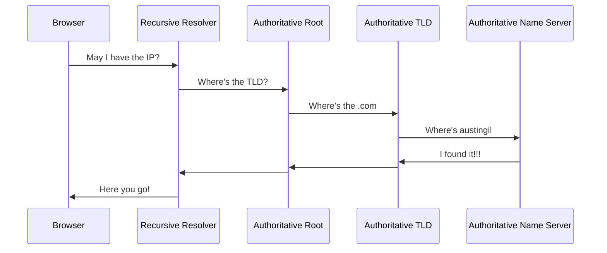
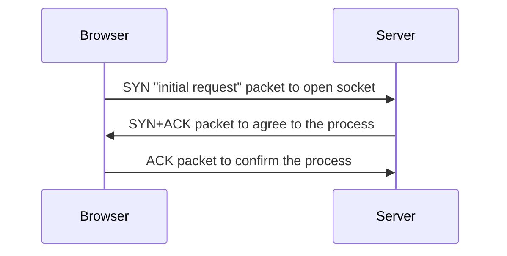

---
layout: statement
---

# Story time

<!-- - Junior developer code changes not showing in the browser.
- I noticed the issue was not the code, but how the tooling worked.
- "How does that div get to the browser"
- "The browser opens up the vue app, the router finds match, and loads the .vue component."

Which is kind right, but missing some steps. -->

---
layout: statement
---

# Let's take a trip back in time

<!-- When you'd play outside, scrape your knee, and your dad would literally rub dirt in it.

You get home and run upstairs. GATEWAY 2000 PENTIUM II

As the 64 MB of RAM kick in and the fans start whining, you yell down the stairs

"Get off the phone! I need to use the internet."

Then you get that sweet, sweet sound 

Give me that sound, concentrated, straight to the vein -->

---
preload: false
---

<audio autoplay>
  <source src="/img/make-div/dial-up.mp3" type="audio/mpeg">
</audio>

---
layout: statement
---

# 🤔
# Version control?

---
layout: statement
---

# 🤨
# CI/CD?

---
layout: statement
---

# 🤣
# Deploy previews?

---

# We had two tools

<v-clicks>
<div class="grid gap-4 grid-cols-2">


</div>
</v-clicks>

---
layout: statement
---

# 😁
# Those were good times...

---
layout: statement
---

# 😃
# Simple times...

---
layout: statement
---

# 😐
# But things had to change...

---
layout: statement
---

# 😑
# The internet changed...

---
layout: statement
---

# 😒
# It got complicated...

---
layout: statement
---

# 😔
# So tooling had to evolve...

<!-- CD was the thing the internet came on

Deploy previews? We didn't even have staging sites. Just edited in production. Cowboy coding. THe most alive I've ever felt -->

---
layout: image
image: /img/make-div/logos.svg
---

<!-- # WTF have we done!?!? -->

---
layout: statement
---

# What's a dev gotta do to make a \<div\> around here!?

A journey following your code from the editor
through build processes <br> 
into deployment pipelines
out to the public internet <br>
and finally rendered in a user's browser

---

# Start with a bit of magic

What's the first thing you do before you start writing code?

<v-clicks>

Terminal + magical incantation (e.g. `npm run dev`)

Starts a local dev server.
</v-clicks>

---

# Why do I need a dev server?

<v-clicks>

- File (`file:///C:/index.html`) != HTTP (`http://localhost:42069`)
- Support GET, POST, PUT, PATCH, DELETE, etc. 
- Absolute (`/path`) vs. relative (`../path`)
- Server-side rendering
- No latency === faster
- Can work offline
- Run background processes...
</v-clicks>

---

# File Watchers

<v-clicks>

Websites don't know when a files have changed.

In the past: `ctrl+r` || `F5` (carpal tunnel 😱)

These days: `ctrl+s` => instant browser updates 

Sometimes called "**Hot Module Replacement**" or HMR.
</v-clicks>

---

# HMR

<v-clicks>

- Dev server starts file watcher to listen for changes (e.g. `chokidar`)
- On file change, dev server may respond: **compiling, transpiling, bundling**
- Dev server sends changes to client (e.g. `WebSockets`)
- Client updates the web app
</v-clicks>
<v-click>

You can even see this in the network tab if you're into that sort of thing...

</v-click>

---
layout: statement
---

# Compiling, Transpiling, Bundling...what?

---

# More Magic When You Save

```jsx
// main.js
import React from 'react'
import ReactDOM from 'react-dom/client'
import App from './App.jsx'

ReactDOM.createRoot(document.getElementById('root')).render(
  <App />
)
```

<v-clicks>

Modern apps have several files called **modules**.

These modules get stitched together by a **bundler** (e.g. `rollup`).

</v-clicks>

---
layout: image-left
image: img/make-div/flo.png
---

# Bundling is cool!

<v-clicks>

You provide entry point (e.g `main.js`)

Bundler maps out file relationship.

"**Dependency Resolution**"

Avoids duplicate code.

Prevents circular dependencies.

Resulting in a dependency graph...

</v-clicks>

---
layout: image
image: img/make-div/dependency-graph.jpg
---

---

# But there's still one problem...

<div class="grid grid-cols-2">
<v-clicks>
<div>

### What you see:
- .jsx
- .tsx
- .vue
- .svelte
- .astro
- .webc
</div>
<div>

### What the browser sees:
<div class="mt-10 text-5xl font-mono">¯\_(ツ)_/¯</div>
</div>
</v-clicks>
</div>

---
layout: image
image: /img/make-div/spongebob.jpg
---

<style>
.animate-letters span {
  opacity: 0;
  animation: fadein .3s ease-in forwards;
}
.animate-letters span:nth-child(2) {
  animation-delay: 0.1s;
}
.animate-letters span:nth-child(3) {
  animation-delay: 0.2s;
}
.animate-letters span:nth-child(4) {
  animation-delay: 0.3s;
}
.animate-letters span:nth-child(5) {
  animation-delay: .4s;
}
.animate-letters span:nth-child(6) {
  animation-delay: .5s;
}
.animate-letters span:nth-child(7) {
  animation-delay: .6s;
}
.animate-letters span:nth-child(8) {
  animation-delay: .7s;
}
.animate-letters span:nth-child(9) {
  animation-delay: .8s;
}
.animate-letters span:nth-child(10) {
  animation-delay: .9s;
}
.animate-letters span:nth-child(11) {
  animation-delay: 1s;
}
.animate-letters span:nth-child(12) {
  animation-delay: 1.1s;
}
.animate-letters span:nth-child(13) {
  animation-delay: 1.2s;
}
@keyframes fadein {
  0%   { opacity: 0; }
  100% { opacity: 1; }
}
</style>

<h1 class="text-center">
<span class="animate-letters text-8xl" style="-webkit-text-stroke: 1px black;">
<span>T</span>
<span>r</span>
<span>a</span>
<span>n</span>
<span>s</span>
<span>p</span>
<span>i</span>
<span>l</span>
<span>a</span>
<span>t</span>
<span>i</span>
<span>o</span>
<span>n</span>
</span>
</h1>

---

# Transpilers (e.g. `babel`)

<v-clicks>
<div>

### What:
<div class="text-2xl mb-4">
Like a combination of a compiler and a translator.<br>
Converts source code into another equivalent language and/or syntax.
</div>
</div>
<div>

### Why: 
<div class="text-2xl mb-4">
Turn language browsers don't understand (<b>TS</b>) into one they do (<b>JS</b>).<br>
Turn syntax browsers don't understand (<b>ESNext</b>) into one they do (<b>ES2015</b>).
</div>
</div>
<div>

### How (depends on transpiler):
1. Generate tokens for each part of the source code.<br>
2. Transform tokens into an Abstract Syntax Tree (AST).
</div>
</v-clicks>

---
layout: statement
---

# WTF is an AST!?!?


---

<style>
.slidev-code-wrapper.slidev-vclick-hidden {
  display: none;
}
</style>

<div class="grid grid-cols-2 gap-4">
<div>

JS program:
<div class="grid">

<div class="col-start-1	row-start-1	slidev-code-wrapper relative group"><pre class="slidev-code language-js"><code><span class="line slidev-vclick-target highlighted">console<span class="token punctuation">.</span><span class="token function">log</span><span class="token punctuation">(</span><span class="token string">'poop'</span><span class="token punctuation">)</span></span></code></pre><button class="slidev-code-copy absolute top-0 right-0 transition opacity-0 group-hover:opacity-20 hover:!opacity-100" title="Copy"><svg class="slidev-icon p-2 w-8 h-8" preserveAspectRatio="xMidYMid meet" viewBox="0 0 256 256" width="1.2em" height="1.2em"><path fill="currentColor" d="M200 32h-36.3a47.8 47.8 0 0 0-71.4 0H56a16 16 0 0 0-16 16v168a16 16 0 0 0 16 16h144a16 16 0 0 0 16-16V48a16 16 0 0 0-16-16Zm-72 0a32.1 32.1 0 0 1 32 32H96a32.1 32.1 0 0 1 32-32Zm72 184H56V48h26.8A47.2 47.2 0 0 0 80 64v8a8 8 0 0 0 8 8h80a8 8 0 0 0 8-8v-8a47.2 47.2 0 0 0-2.8-16H200Z"></path></svg></button></div>

<div v-click="6" class="col-start-1	row-start-1	slidev-code-wrapper relative group"><pre class="slidev-code language-js"><code class="opacity-30"><span class="line slidev-vclick-target highlighted">console<span class="token punctuation">.</span><span class="token function">log</span><span class="token punctuation">(</span><span class="token string">'poop'</span><span class="token punctuation">)</span></span></code></pre><button class="slidev-code-copy absolute top-0 right-0 transition opacity-0 group-hover:opacity-20 hover:!opacity-100" title="Copy"><svg class="slidev-icon p-2 w-8 h-8" preserveAspectRatio="xMidYMid meet" viewBox="0 0 256 256" width="1.2em" height="1.2em"><path fill="currentColor" d="M200 32h-36.3a47.8 47.8 0 0 0-71.4 0H56a16 16 0 0 0-16 16v168a16 16 0 0 0 16 16h144a16 16 0 0 0 16-16V48a16 16 0 0 0-16-16Zm-72 0a32.1 32.1 0 0 1 32 32H96a32.1 32.1 0 0 1 32-32Zm72 184H56V48h26.8A47.2 47.2 0 0 0 80 64v8a8 8 0 0 0 8 8h80a8 8 0 0 0 8-8v-8a47.2 47.2 0 0 0-2.8-16H200Z"></path></svg></button></div>

<div v-click="7" class="col-start-1	row-start-1	slidev-code-wrapper relative group"><pre class="slidev-code language-js"><code><span class="line slidev-vclick-target highlighted">console<span class="opacity-30 token punctuation">.</span><span class="token function">log</span><span class="token punctuation">(</span><span class="opacity-30 token string">'poop'</span><span class="token punctuation">)</span></span></code></pre><button class="slidev-code-copy absolute top-0 right-0 transition opacity-0 group-hover:opacity-20 hover:!opacity-100" title="Copy"><svg class="slidev-icon p-2 w-8 h-8" preserveAspectRatio="xMidYMid meet" viewBox="0 0 256 256" width="1.2em" height="1.2em"><path fill="currentColor" d="M200 32h-36.3a47.8 47.8 0 0 0-71.4 0H56a16 16 0 0 0-16 16v168a16 16 0 0 0 16 16h144a16 16 0 0 0 16-16V48a16 16 0 0 0-16-16Zm-72 0a32.1 32.1 0 0 1 32 32H96a32.1 32.1 0 0 1 32-32Zm72 184H56V48h26.8A47.2 47.2 0 0 0 80 64v8a8 8 0 0 0 8 8h80a8 8 0 0 0 8-8v-8a47.2 47.2 0 0 0-2.8-16H200Z"></path></svg></button></div>

<div v-click="8" class="col-start-1	row-start-1	slidev-code-wrapper relative group"><pre class="slidev-code language-js"><code><span class="line slidev-vclick-target highlighted">console<span class="opacity-30 token punctuation">.</span><span class="opacity-30 token function">log</span><span class="opacity-30 token punctuation">(</span><span class="opacity-30 token string">'poop'</span><span class="opacity-30 token punctuation">)</span></span></code></pre><button class="slidev-code-copy absolute top-0 right-0 transition opacity-0 group-hover:opacity-20 hover:!opacity-100" title="Copy"><svg class="slidev-icon p-2 w-8 h-8" preserveAspectRatio="xMidYMid meet" viewBox="0 0 256 256" width="1.2em" height="1.2em"><path fill="currentColor" d="M200 32h-36.3a47.8 47.8 0 0 0-71.4 0H56a16 16 0 0 0-16 16v168a16 16 0 0 0 16 16h144a16 16 0 0 0 16-16V48a16 16 0 0 0-16-16Zm-72 0a32.1 32.1 0 0 1 32 32H96a32.1 32.1 0 0 1 32-32Zm72 184H56V48h26.8A47.2 47.2 0 0 0 80 64v8a8 8 0 0 0 8 8h80a8 8 0 0 0 8-8v-8a47.2 47.2 0 0 0-2.8-16H200Z"></path></svg></button></div>

<div v-click="9" class="col-start-1	row-start-1	slidev-code-wrapper relative group"><pre class="slidev-code language-js"><code><span class="line slidev-vclick-target highlighted"><span class="opacity-30">console</span><span class="opacity-30 token punctuation">.</span><span class="token function">log</span><span class="opacity-30 token punctuation">(</span><span class="opacity-30 token string">'poop'</span><span class="opacity-30 token punctuation">)</span></span></code></pre><button class="slidev-code-copy absolute top-0 right-0 transition opacity-0 group-hover:opacity-20 hover:!opacity-100" title="Copy"><svg class="slidev-icon p-2 w-8 h-8" preserveAspectRatio="xMidYMid meet" viewBox="0 0 256 256" width="1.2em" height="1.2em"><path fill="currentColor" d="M200 32h-36.3a47.8 47.8 0 0 0-71.4 0H56a16 16 0 0 0-16 16v168a16 16 0 0 0 16 16h144a16 16 0 0 0 16-16V48a16 16 0 0 0-16-16Zm-72 0a32.1 32.1 0 0 1 32 32H96a32.1 32.1 0 0 1 32-32Zm72 184H56V48h26.8A47.2 47.2 0 0 0 80 64v8a8 8 0 0 0 8 8h80a8 8 0 0 0 8-8v-8a47.2 47.2 0 0 0-2.8-16H200Z"></path></svg></button></div>

<div v-click="10" class="col-start-1	row-start-1	slidev-code-wrapper relative group"><pre class="slidev-code language-js"><code><span class="line slidev-vclick-target highlighted"><span class="opacity-30">console</span><span class="opacity-30 token punctuation">.</span><span class="opacity-30 token function">log</span><span class="opacity-30 token punctuation">(</span><span class="token string">'poop'</span><span class="opacity-30 token punctuation">)</span></span></code></pre><button class="slidev-code-copy absolute top-0 right-0 transition opacity-0 group-hover:opacity-20 hover:!opacity-100" title="Copy"><svg class="slidev-icon p-2 w-8 h-8" preserveAspectRatio="xMidYMid meet" viewBox="0 0 256 256" width="1.2em" height="1.2em"><path fill="currentColor" d="M200 32h-36.3a47.8 47.8 0 0 0-71.4 0H56a16 16 0 0 0-16 16v168a16 16 0 0 0 16 16h144a16 16 0 0 0 16-16V48a16 16 0 0 0-16-16Zm-72 0a32.1 32.1 0 0 1 32 32H96a32.1 32.1 0 0 1 32-32Zm72 184H56V48h26.8A47.2 47.2 0 0 0 80 64v8a8 8 0 0 0 8 8h80a8 8 0 0 0 8-8v-8a47.2 47.2 0 0 0-2.8-16H200Z"></path></svg></button></div>

</div>
</div>
<div>

AST representation (by [shift-js](https://github.com/shift-js/shift-js)):
<div style="font-size: 10px;">

```json {all|2|6-8,16,23|11-14|15|17-22}
{
  "type": "Module",
  "directives": [],
  "items": [
    {
      "type": "ExpressionStatement",
      "expression": {
        "type": "CallExpression",
        "callee": {
          "type": "StaticMemberExpression",
          "object": {
            "type": "IdentifierExpression",
            "name": "console"
          },
          "property": "log"
        },
        "arguments": [
          {
            "type": "LiteralStringExpression",
            "value": "poop"
          }
        ]
      }
    }
  ]
}
```
</div>
</div>
</div>

<div>More languages/transpilers at <a href="https://astexplorer.net/">astexplorer.net</a></div>

---

# Great! But what can I do with it?

<v-clicks>

1. Create a parser program called a "**Visitor**".
2. Transpiler can "walk" the Visitor through "tokens" and do **[insert action]**. 
3. Makes it possible to **add, remove, transform**, anything you want.
</v-clicks>
<v-click>

<h2 class="mt-10">Good example:</h2>

<div class="flex items-center gap-4 text-4xl">
<svg width="150" height="150" viewBox="0 0 32 32"><rect width="28" height="28" x="2" y="2" fill="#3178c6" rx="1.312"/><path fill="#fff" fill-rule="evenodd" d="M18.245 23.759v3.068a6.492 6.492 0 0 0 1.764.575a11.56 11.56 0 0 0 2.146.192a9.968 9.968 0 0 0 2.088-.211a5.11 5.11 0 0 0 1.735-.7a3.542 3.542 0 0 0 1.181-1.266a4.469 4.469 0 0 0 .186-3.394a3.409 3.409 0 0 0-.717-1.117a5.236 5.236 0 0 0-1.123-.877a12.027 12.027 0 0 0-1.477-.734q-.6-.249-1.08-.484a5.5 5.5 0 0 1-.813-.479a2.089 2.089 0 0 1-.516-.518a1.091 1.091 0 0 1-.181-.618a1.039 1.039 0 0 1 .162-.571a1.4 1.4 0 0 1 .459-.436a2.439 2.439 0 0 1 .726-.283a4.211 4.211 0 0 1 .956-.1a5.942 5.942 0 0 1 .808.058a6.292 6.292 0 0 1 .856.177a5.994 5.994 0 0 1 .836.3a4.657 4.657 0 0 1 .751.422V13.9a7.509 7.509 0 0 0-1.525-.4a12.426 12.426 0 0 0-1.9-.129a8.767 8.767 0 0 0-2.064.235a5.239 5.239 0 0 0-1.716.733a3.655 3.655 0 0 0-1.171 1.271a3.731 3.731 0 0 0-.431 1.845a3.588 3.588 0 0 0 .789 2.34a6 6 0 0 0 2.395 1.639q.63.26 1.175.509a6.458 6.458 0 0 1 .942.517a2.463 2.463 0 0 1 .626.585a1.2 1.2 0 0 1 .23.719a1.1 1.1 0 0 1-.144.552a1.269 1.269 0 0 1-.435.441a2.381 2.381 0 0 1-.726.292a4.377 4.377 0 0 1-1.018.105a5.773 5.773 0 0 1-1.969-.35a5.874 5.874 0 0 1-1.805-1.045Zm-5.154-7.638h4v-2.527H5.938v2.527H9.92v11.254h3.171Z"/></svg>

<p class="font-mono">===></p>

<svg width="150" height="150" viewBox="0 0 32 32"><path fill="#f5de19" d="M2 2h28v28H2z"/><path d="M20.809 23.875a2.866 2.866 0 0 0 2.6 1.6c1.09 0 1.787-.545 1.787-1.3c0-.9-.716-1.222-1.916-1.747l-.658-.282c-1.9-.809-3.16-1.822-3.16-3.964c0-1.973 1.5-3.476 3.853-3.476a3.889 3.889 0 0 1 3.742 2.107L25 18.128A1.789 1.789 0 0 0 23.311 17a1.145 1.145 0 0 0-1.259 1.128c0 .789.489 1.109 1.618 1.6l.658.282c2.236.959 3.5 1.936 3.5 4.133c0 2.369-1.861 3.667-4.36 3.667a5.055 5.055 0 0 1-4.795-2.691Zm-9.295.228c.413.733.789 1.353 1.693 1.353c.864 0 1.41-.338 1.41-1.653v-8.947h2.631v8.982c0 2.724-1.6 3.964-3.929 3.964a4.085 4.085 0 0 1-3.947-2.4Z"/></svg>
</div>

</v-click>

---

# Putting it all together

<div class="grid gap-4 grid-cols-2">
<div>
<div class="text-sm">

```jsx
// main.jsx
import React from 'react'
import ReactDOM from 'react-dom/client'
import App from './App.jsx'

ReactDOM.createRoot(
  document.getElementById('root')
).render(<App />)
```
</div>

- 4 separate files/libraries
- Written in JSX
- Uses modern syntax
</div>
<v-click>
<div>


- One 139.76kb file
- Written in JavaScript
- Supports older syntax

</div>
</v-click>
</div>

---
layout: image
image: img/make-div/createElement.png
---

---

# Keep in mind

<v-clicks>

- Code in editor != code in the browser.
- Client-side JS app != SSR or SSG.
</v-clicks>

---
layout: statement
---

# Deploying

## <span class="font-mono text-4xl">(╯°□°）╯︵ ┻━┻  ===> ┳━┳ ノ(゜-゜ノ)</span>

---
class: text-5xl
---

# How my code gets to production

<v-clicks>

1. Make change
2. Git commit 
3. Git push
4. (∩^ᗜ^)⊃━☆ﾟ.\* (???) 
</v-clicks>

<!--  In the old days, we'd just drag that sucker over the FileZilla GUI and drop it on the server. Of course, that's assuming we weren't just live editing the file on the server. Not anymore. Today, thing look a bit different. -->

---

# Cont. Integration & Delivery (CI/CD)

<v-clicks>

Most Git services offer tools to respond to commits (e.g **GitHub Actions**).

With GitHub Actions:
</v-clicks>
<v-clicks>

- Create a folder called `.github/workflows/`.
- Add a `.yml` file (e.g. `ci.yml`).
- Push new commit to GitHub.
- GitHub runs our Action.
</v-clicks>

---

# Example

Instructions for the Octocats:

<div class="grid gap-4 grid-cols-2">
<div v-click="1" class="text-sm">

```yml {all|all|4|6|8|10|12}
# ci.yml
jobs:
  deploy:
    runs-on: ubuntu-latest
    steps:
      - uses: actions/checkout@v2

      - run: npm ci

      - run: npm run build

      - run: npm run deploy

```
</div>
<div class="text-2xl">
<div v-click="1" class="mt-4">A machine on GitHub's servers</div>
<div v-click="2" class="mt-4">running Ubuntu OS</div>
<div v-click="3" class="mt-3">checks out your repo's code,</div>
<div v-click="4" class="mt-3">installs NPM dependencies,</div>
<div v-click="5" class="mt-2">then runs "build",</div>
<div v-click="6" class="mt-3">then runs "deploy".</div>
</div>
</div>

---
layout: statement
---

# What do `build` and `deploy` do?

---
layout: statement
---

<div class="text-9xl">It depends™<br>💩</div>

---

# Could be...

<v-clicks>

- Use Vite to create production artifacts & `scp` to upload to servers.
- Create docker image & send to a registry.
- Run code quality checks (e.g. `TypeScript`, `ESLint`, `Vitest`).
- Generate static site & distribute to CDN (e.g. [Akamai CDN](https://www.akamai.com/solutions/content-delivery-network)).
- Run a bunch of `bash` scripts Larry wrote (too afraid to touch)
</v-clicks>

---

# Keep in mind

<v-clicks>

- 3 different computers:
  1. **Development** (e.g. Your laptop)
  2. **CI/CD** (e.g. GitHub Actions)
  3. **Production** (e.g. Linode)
- Dev != CI/CD != Prod
- Dev artifacts != production artifacts
</v-clicks>

---
layout: image
image: img/make-div/europe.jpg
class: grid place-items-center text-center
---

<!--  -->
<div style="-webkit-text-stroke: 1px black;">

# It's the final question
### (dee duh dee doo)
### (dee duh dee dee doo)
</div>

---

# How do users get...

<div class="grid grid-cols-2">
  <v-clicks>
    <div class="aspect-square	">
      <div>from this...</div>
      
    </div>
    <div class="aspect-square	">
      <div>...to this?</div>
      
    </div>
  </v-clicks>
</div>

---
layout: statement
---

# Step 1 - Networking 

# <span class="font-mono">(☞ﾟヮﾟ)☞   ☜(ﾟヮﾟ☜)</span>

---

# To load [austingil.com](https://austingil.com)

Browser need the IP address
<v-clicks>

1. Check browser cache.
2. Check local hosts file.
3. Check network stack.
    - Router cache?
    - ISP cache?
</v-clicks>

---

# No cache? DNS lookup time!

<v-clicks>

1. Send request to DNS Recursive Resolver.
2. Forwards to Authoritative Root nameserver.
3. Forwards to Top Level Domain (TLD) nameserver (`.com`, `.net`, `.pizza`).
4. Forwards to `austingil.com`'s nameserver
5. IP is returned to the Resolver.
6. IP is returned to the browser.
7. Browser can connect to server.
</v-clicks>

---


<!--

-->

---

# Keep in mind

Caching is a thing (and a pain in the butt):

<v-click>

- Browser
- Operating system
- Router
- ISP
<!-- - Edge compute
- Server -->
</v-click>

---
layout: statement
---

# Step 2 - Connecting 
# <span class="font-mono">💗(¯ з¯) (¯ε ¯)💗</span>

---

# Four parts

<v-clicks>

- 2.1 Prepare the packet
- 2.2 Open the connection
- 2.3 Secure the connection
- 2.4 Make the request
</v-clicks>

---

# 2.1 Prepare a packet

**Packet**: a small chunck of data from a larger message.

<v-click>

With the IP, browser can prepare packet.
</v-click>


<!-- - Ethernet -> modem -> ISP
- WiFi -> router -> modem -> ISP
- Cellular data network -->

---

# 2.2 Open the connection

**Internet Protocol (IP)**: Guarantees the correct address.

**Transmission Control Protocol (TCP)**: Guarantees accurate delivery.

<!-- The first thing browsers do when connecting to the correct web server is set up a TCP connection. This protocol handles the transmission of all data. It divides large files into small chunks that are sent one by one, and also checks incoming data for errors or missing parts, re-requesting chunks when necessary. -->

<v-clicks>

Your computer and the server connect using "TCP over IP" (or TCP/IP).

</v-clicks>

---

<!--
# TCP "handshake"


-->

# 2.3 Secure connection

<v-clicks>

**Secure Socket Layers (SSL)**: cryptographic protocol to encrypt data and authenticate a connection on the Internet

**Transport Layer Security (TLS)**: cryptographic protocol to encrypt data and authenticate a connection on the Internet

"Um, actually SSL != TLS"

For HTTPS green lock, you need SSL (or TLS)

</v-clicks>

---


---

# SSL (or TLS) "handshake"


<!-- <v-clicks>

- Specify TLS version
- Decide on cipher suites
- Verify server's identity with it's TLS certificate
- Handhske is complete & session key is generated for encrypting data
</v-clicks> -->

---
class: text
---

# 2.4 Make the request

<div class="grid grid-cols-3 gap-4">

<div v-click="1">
<h2 class="-mb-4 text-center">Browser</h2>
<span class="block text-10xl text-center">💻 </span>
<div class="text-sm">

```sh
GET / HTTP/1.1
Host: austingil.com
Connection: close
[...request headers]
```
</div>

Request using Hypertext Transfer Protocol (HTTP).
</div>

<div v-click="3">
<div class="text-center text-4xl">
  <h2 class="-mb-4 text-center">Edge Compute</h2>
  <logos-akamai class="text-10xl -mb-20 -mt-6"/>
  <p>EdgeWorkers</p>
  <vscode-icons:file-type-http class="text-8xl"/>
  <!-- <material-symbols-edit-outline class="text-8xl"/> -->
  <!-- <material-symbols-edit-road-outline class="text-8xl"/> -->
  <gis-modify-line class="text-8xl"/>
</div>
<p>Modify request and/or response between client and server</p>
</div>

<div v-click="2">
<h2 class="text-center">Server</h2>
<logos-linode class="block text-8xl mt-4 mb-6 mx-auto"/>
<div class="text-sm">

```sh
HTTP/1.1 200 OK
Content-Type: text/html
Connection: Closed
[...response headers]

<!DOCTYPE html><html><head>...
```
</div>
<p>Generates HTML for HTTP response</p>
</div>

</div>

---

# Browser parses HTML

<v-clicks>

Multiple resources (fonts, styles, scripts, etc)?

Repeats process each one.

Different domains (CDN)?

Go back to DNS lookup.
</v-clicks>

<!-- Caching?

Browser, ISP, CDN, server

CDNs

JavaScript and CSS files, are considered blocking resources. When browsers encounter blocking resources they stop parsing the HTML until the blocking resource has been completely downloaded and parsed as well, and any JavaScript has been executed. -->

---
layout: statement
---

# Step 3 - Rendering 
# <span class="font-mono"> 💩 🖌️ლ( ͡°෴ ͡° )</span>

---

# Critical rendering path

<!-- The browser must complete several steps to render a web page -->

<v-clicks>

- Construct the DOM Tree (Object representation of HTML)
- Construct the CSSOM Tree (Object representation of DOM styles)
- <span class="text-yellow-500">Run JavaScript</span>
- Create Render Tree (DOM + CSSOM for RENDERED nodes)
- <span class="text-purple-500">Calculate styles</span>
- <span class="text-purple-500">Generate layout</span>
- Create animations layers
- <span class="text-green-500">Paint content as px to respective layer</span>
- <span class="text-green-500">Composite (flatten everythings onto the screen)</span>

</v-clicks>

---

# Keep in mind

How you write CSS and JS impacts Style, Layout, Paint


<br>

<v-click>
<div class="grid grid-cols-2">

Explore Critical Render Path


</div>
</v-click>

---
layout: statement
---

# That's it
# 🤮

---

# "Why is the website broken?"

<div class="leading-loose">
<v-clicks>
<span class="inline-block">Make a change ->&nbsp;</span>
<span class="inline-block">git commit ->&nbsp;</span>
<span class="inline-block">git push ->&nbsp;</span>
<span class="inline-block">CI/CD pipeline ->&nbsp;</span>
<span class="inline-block">transpile ->&nbsp;</span>
<span class="inline-block">"Dependency Resolution" ->&nbsp;</span>
<span class="inline-block">bundle ->&nbsp;</span>
<span class="inline-block">package ->&nbsp;</span>
<span class="inline-block">uploaded to prod ->&nbsp;</span>
<span class="inline-block">URL ->&nbsp;</span>
<span class="inline-block">Browser ->&nbsp;</span>
<span class="inline-block">OS ->&nbsp;</span>
<span class="inline-block">Wifi ->&nbsp;</span>
<span class="inline-block">Router ->&nbsp;</span>
<span class="inline-block">Modem ->&nbsp;</span>
<span class="inline-block">ISP ->&nbsp;</span>
<span class="inline-block">DNS resolution ->&nbsp;</span>
<span class="inline-block">server's IP ->&nbsp;</span>
<span class="inline-block">TCP handshake ->&nbsp;</span>
<span class="inline-block">TLS handshake ->&nbsp;</span>
<span class="inline-block">HTTP request ->&nbsp;</span>
<span class="inline-block">EdgeWorker ->&nbsp;</span>
<span class="inline-block">Linode ->&nbsp;</span>
<span class="inline-block">EdgeWorker ->&nbsp;</span>
<span class="inline-block">HTTP response ->&nbsp;</span>
<span class="inline-block">download HTML ->&nbsp;</span>
<span class="inline-block">download CSS ->&nbsp;</span>
<span class="inline-block">download JS ->&nbsp;</span>
<span class="inline-block">Construct DOM ->&nbsp;</span>
<span class="inline-block">Construct CSSOM ->&nbsp;</span>
<span class="inline-block">Run JS ->&nbsp;</span>
<span class="inline-block"><code>document.createElement('div');</code> ->&nbsp;</span>
<span class="inline-block">Render ->&nbsp;</span>
<span class="inline-block">Layout ->&nbsp;</span>
<span class="inline-block">Paint ->&nbsp;</span>
<span class="inline-block">Composite</span>
</v-clicks>
</div>

---
layout: statement
---

## Or you could just say:
<v-clicks>

# It works on my machine...

# Have you tried clearing your cache?
</v-clicks>

---

# Resources: 

[Transpilers: How They Work and How To Build Your Own JS Transpiler](https://daily.dev/blog/transpilers-how-they-work) by [Chidume Nnamdi](https://twitter.com/ngArchangel)

[What happens when](https://github.com/alex/what-happens-when) by [Alex Gaynor](https://alexgaynor.net/)

---
src: outro.md
---